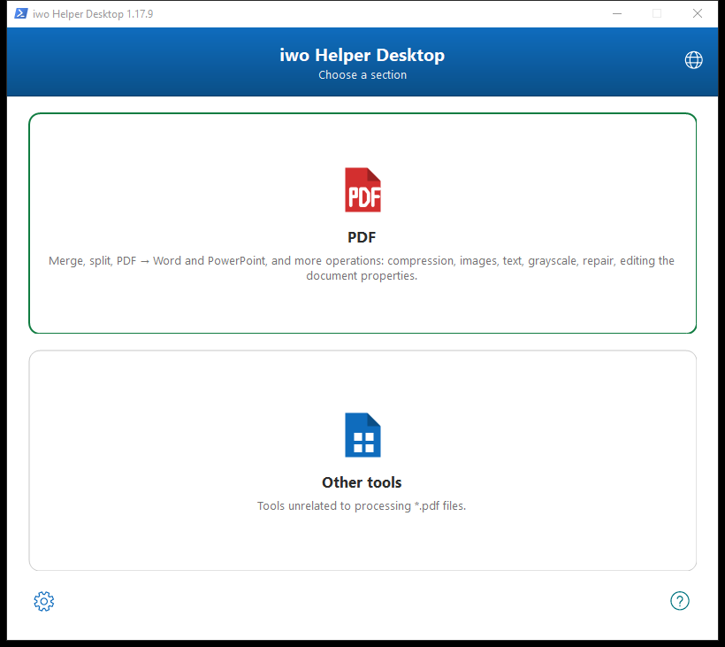
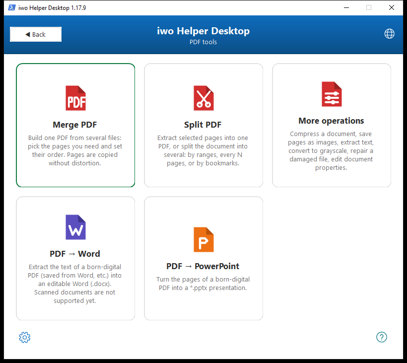
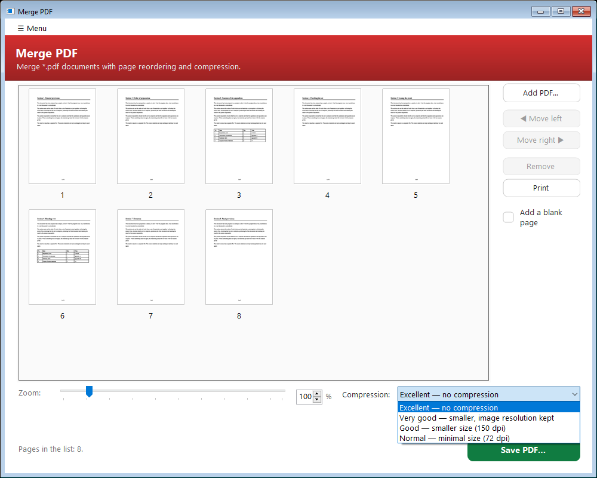
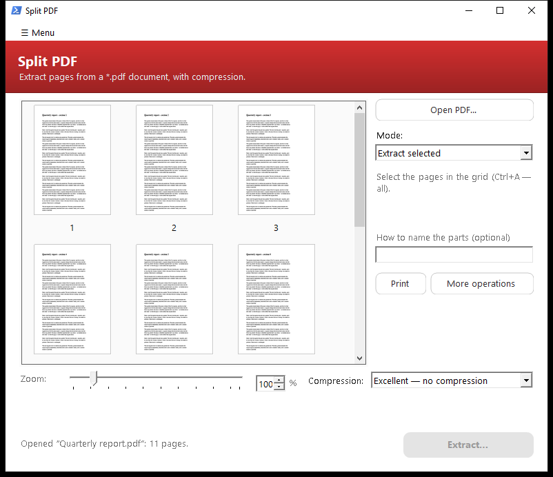
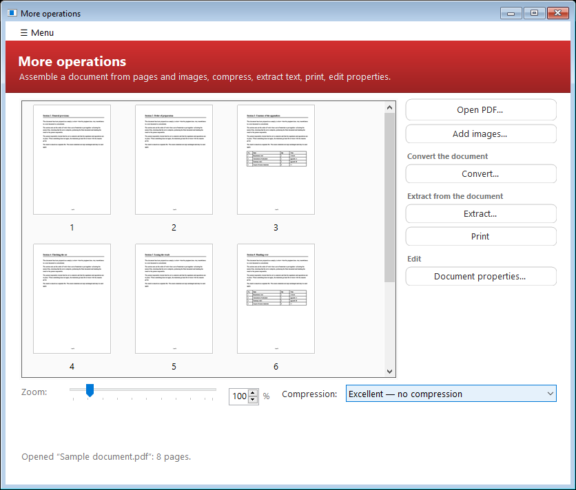
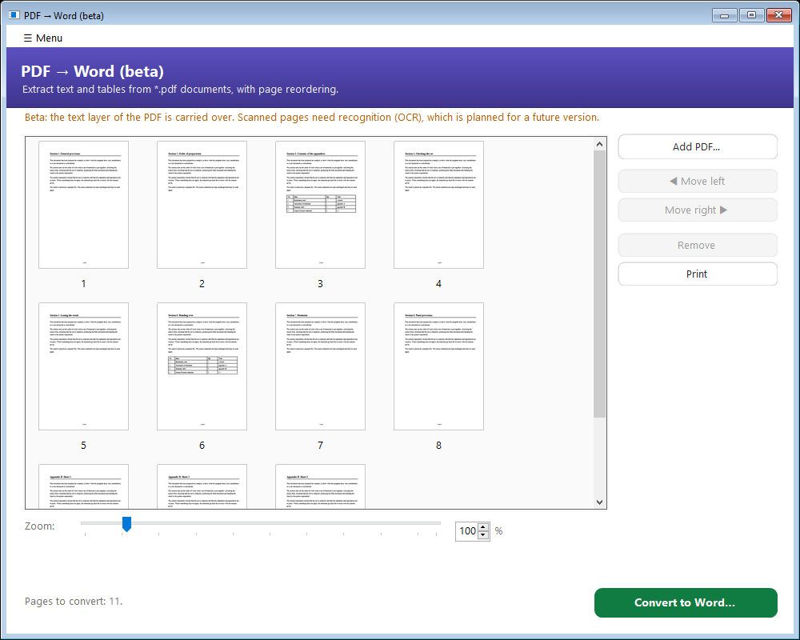
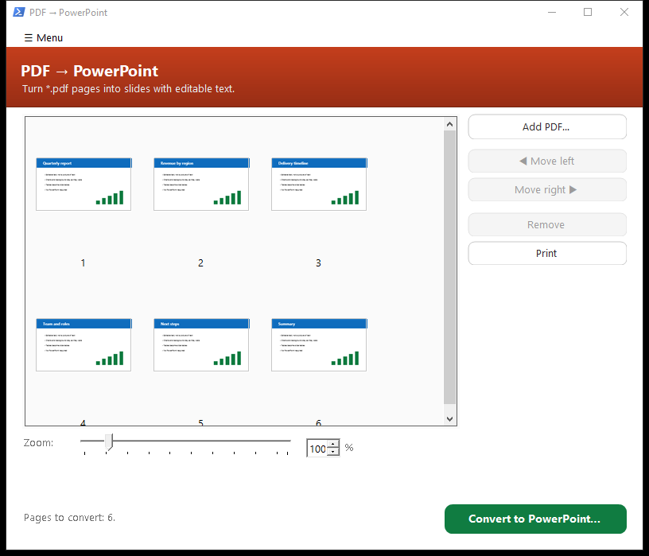
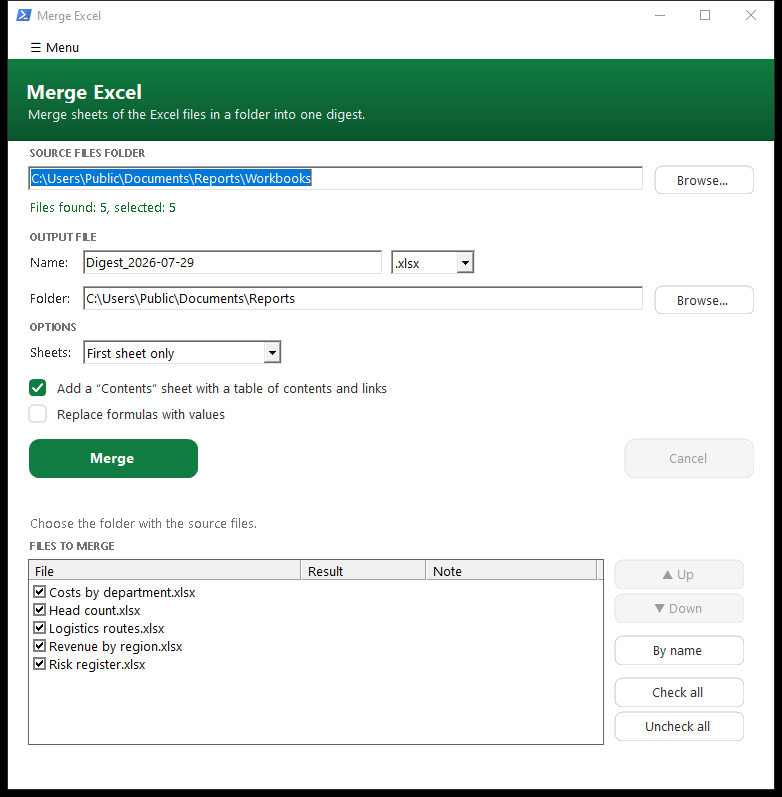
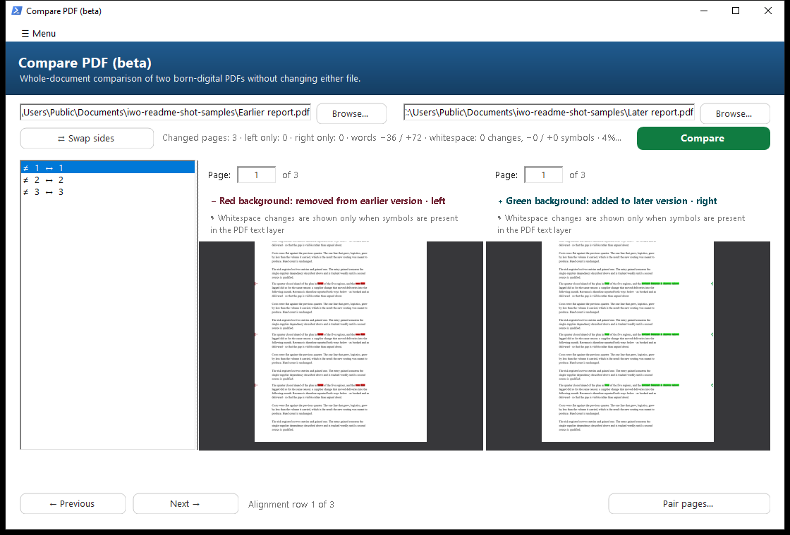

<div align="center">


<br>

[](https://github.com/DedovMosol/iwoHelperDesktop/actions/workflows/ci.yml) [](https://github.com/DedovMosol/iwoHelperDesktop/releases/latest) [](https://github.com/DedovMosol/iwoHelperDesktop/releases) [](LICENSE) [](docs/PRIVACY.md)

**Free, offline-first office tools in a single Windows app — merge Excel sheets, merge/split/compress and compare PDFs, and turn born-digital PDFs back into editable Word. No subscription, no admin rights; document processing stays local.**

📐 [Architecture](docs/ARCHITECTURE.md) · 🤝 [Contributing](CONTRIBUTING.md) · 📋 [Changelog](docs/CHANGELOG.md) · 🔒 [Privacy](docs/PRIVACY.md)

</div>

<div align="center">

**Contents** — 🚀 [Features](#-features) · 📸 [Screenshots](#-screenshots) · ⬇️ [Download](#️-download) · 🖥️ [Usage](#️-usage)<br>🛠️ [Build from source](#️-build-from-source) · 🧩 [Built with](#-built-with) · 🔒 [Privacy](#-privacy) · ⚖️ [License](#️-license)

</div>

## What is iwo Helper Desktop?

A small, self‑contained Windows application that bundles the office tasks people do every day with `.xlsx` and `.pdf` files — without a paid suite. Document processing runs **locally**, it needs **no administrator rights**, and it ships either as a single portable `.exe` or a per‑user installer. The only built-in network feature is the GitHub update check: it reads the latest version tag and, only for a newer version, a short change summary; it sends no document contents, file names, or personal data, and its startup run can be turned off.

## 🚀 Features

Seven tools behind one start screen with two sections (PDF and everything else) — each opens in its own window, runs long tasks in the background (with a Cancel button and taskbar progress), and remembers your last settings.

### 📊 Merge Excel
Merge the first — or every — visible sheet of every workbook in a folder (`.xlsx`/`.xlsm`/`.xlsb`/`.xls`) into one file with all formatting intact (styles, formulas, charts, pivots), plus a table of contents, optional formula→value conversion, and a Word cover note.
### 📄 PDF Merge
Build one PDF from several on a thumbnail grid — reorder, rotate, cut/copy/paste pages, set an exact zoom %, preview a page, and choose a compression level. Pages are copied **as‑is**, so nothing on them is re‑rendered.

<details><summary><b>All grid and merge features</b></summary>

- Zoom up to 400 px shown as an editable **percentage** — the “%” box, the slider, Ctrl+wheel, Ctrl+«+»/«−», or Ctrl+0 to reset to 100 %. **Home**/**End** jump to the first/last page.
- **Double‑click** a page for a full‑size preview — right‑click it there to rotate, zoom with − / + or Ctrl+wheel, print it, and minimize it to the taskbar like any other window. It reopens at the size you left it (or double‑click a page number to move that page). Reorder by dragging, the grid auto‑scrolls at the edges.
- **Cut/copy/paste** pages (Ctrl+X/C/V) with an insertion caret, **Move after page N…** for exact long jumps, Ctrl+Z / Ctrl+Y to undo and redo (rotations included).
- **Rotate** the selection or the whole document 90° (right‑click, Ctrl+Shift+«+»/«−», or the ↺/↻ buttons on the hovered tile) — the same keys and menu work inside the full‑size preview, and thumbnails follow at once.
- **Drop more PDFs onto the grid** — their pages land at the drop position. Ctrl+G jumps to a page.
- **Cancel** a long save (from five pages). The last zoom, compression level and each window's size and position come back next time (shared with Split and PDF → Word).
</details>
### ✂️ PDF Split
Extract selected pages into one file, or split by page ranges, every N pages, or top‑level bookmarks — with per‑page **rotation** carried into the output in every mode. Original page numbers sit under the thumbnails, a long split can be **cancelled** (from five source pages, removing anything already written), and the source is never modified.
### 🔎 PDF Compare (beta)
Compare an earlier and a later **born-digital** PDF without converting either file. The default **Unified redline** uses the later page as its base: additions and added whitespace stay green, while only deleted fragments and removed whitespace from the earlier page are projected in red with a strike line; unchanged pixels from the earlier version never cover the result. **Side by side** remains one click away with compact colour legends that do not crowd the pages, and switching views never reruns the semantic comparison. Double-click either canvas for a maximized view with the exact same colour markup. Exactly one document-wide comparison of canonical visible words remains the semantic authority; physical page pairing only lays out the viewer and corroborates conservative proofs. A bounded reconciliation removes a form/table extraction-order artifact only when the same words have one unambiguous geometric match, so reflow or re-pagination alone is not an edit and uncertain material remains marked. Earlier removals use tight red (`#EC0808`) marks and later additions use tight green (`#1BE91A`) marks; Windows High Contrast deliberately switches to system-colour outlines and patterns.

<details><summary><b>Sources, navigation and comparison limits</b></summary>

- **Choose sources your way** — browse, type or paste a path, or drop PDFs anywhere over the nested controls. Paths are validated in the background. A password-protected PDF remains selectable and uses the normal in-memory password prompt when comparison starts.
- **Drop routing is explicit** — two PDFs fill left/right in their supplied order; one PDF dropped over a side replaces that side; one dropped on neutral space fills the first empty side. If both sides are already filled, a neutral drop asks for an explicit side instead of replacing one silently; more than two files are refused.
- **Review as a redline or source pages** — Unified redline is the default, and Side by side remains available without recomputing the comparison. The resizable alignment list covers paired and one-sided pages, with previous/next-change navigation and optional manual pairing. Double-click opens the active marked-up page full screen. In side-by-side mode, a normal wheel first scrolls only the pane under the pointer; at a page edge it continues to the nearest row containing a page on that same side, skips gaps, and never wraps. Ctrl+wheel zooms only the active canvas and keeps the PDF point under the pointer in place.
- **Select and copy trusted text** — both page panes remain read-only and keep independent selections. Selection accepts the natural white space around words and continues across nearby gaps, so dragging does not require a pixel-perfect glyph hit. Press Ctrl+A to select the trusted text on the current page, or use Copy / Select all from the local context menu; Ctrl+C publishes Unicode text that can be pasted into an ordinary control or another application. Words come only from the final published PDF text layer and separators only from literal decoded source boundaries. Where no trusted boundary is available, copy inserts one readability space and reports that fallback; it never becomes a whitespace change. OCR, pixels, geometry, visible gaps, wrapping and page boundaries never invent copied content.
- **Formatting is not content** — font family, size, weight, italic, colour, coordinates, page size/orientation, extraction fragmentation, coincident overlays and NFC-equivalent Unicode do not enter word equality. Physical page boundaries and manual page pairing are presentation data, not semantic edit boundaries.
- **Extraction order is not accepted as an edit** — a bounded post-diff pass can reconcile exact repeated words in a table or form only on one explicit page pair and only with unique geometric proof. It does not run a second page-local diff; ambiguity, real movement, unrelated edits or exhausted work limits preserve the original Delete/Insert candidates.
- **Whitespace requires source evidence** — `␠`, `NBSP`, `⇥` and `↵` markers appear only for literal decoded characters (or a positively proven empty boundary) in the PDF text layer. Visual gaps, reconstructed rows, wrapping, page edges and raster pixels never invent whitespace. Whitespace counters are separate from word counts and the word-based changed percentage.
- **Raster refinement is word-only and subtractive** — it may remove only a pre-existing mixed Delete/Insert word hunk owned by one explicit physical-page pair when bounded local ink proves equivalence. It cannot create a match or reinterpret whitespace; a pure one-sided edit, renderer failure, cancellation, exhausted cap or inadequate render keeps the semantic candidate.
- **Scope** — this beta compares PDFs that contain a usable text layer. It does not perform OCR; image-only/scanned documents are rejected with a clear message.
</details>
### 📝 PDF → Word
Turn one or **several born‑digital** PDFs (saved from Word, “Microsoft Print to PDF”, exported from a browser) into a single editable `.docx`, preserving fonts, layout, tables, lists and images.

<details><summary><b>Everything PDF → Word preserves and handles</b></summary>

- **Text formatting** — font family, size, bold/italic, underline, colour, super/subscript, paragraph alignment (left/justify/centre, including a multi‑line centred heading kept as one block), and per‑paragraph first‑line indent. Line spacing is single, so a dense document keeps its original page count on any machine. Cyrillic falls back to Times New Roman when a PDF font isn't installed.
- **Page setup** — per‑page size, orientation (portrait/landscape) and margins are reproduced, and margins account for images so a picture above a heading doesn't push the content down.
- **Tables** — bordered tables become real Word tables (column widths from the ruling, merged cells with colspan/rowspan, per‑cell text). An unruled grid of label/value pairs is rebuilt as a borderless table so the pairs keep their rows.
- **Lists** — numbered and bulleted lists become native Word lists (the source marker is dropped and Word draws its own), with **nested lists** kept up to Word's nine levels (v1.18.4+): the level follows the *depth* of the indent, an outer indent closes the inner levels, and a step under 12 pt counts as the same level so a ragged left edge doesn't invent nesting. Numbering continues across nested text and restarts for a new list.
- **Images** — placed in reading order (a centred picture stays centred), with soft‑transparency images composited onto white instead of a black box. A picture or text‑drawn stamp is transferred as an image.
- **Columns and rhythm** — multi‑column pages are read in the correct order (left column fully, then right), two‑column headers are laid out side by side as a borderless table, and the vertical spacing between blocks is carried over (with a guard so no page is added). Intentional line breaks survive and compound words keep their hyphen at a line break.
- **Multi‑file** — add several PDFs at once (drop onto the grid to insert at a spot), reorder / cut / copy / paste / rotate / preview pages across the whole set, then convert to one document. A long conversion can be **cancelled** with no `.docx` left behind.
- **Limits** — scanned documents aren't supported yet (a clear message is shown instantly and the file is untouched).
</details>
### 📊 PDF → PowerPoint
Turn the pages of one or **several born‑digital** PDFs into a single `.pptx` — one slide per page — where the **text stays real text**: editable, searchable, copyable. **PowerPoint is not required**: the file is built by the app itself.

<details><summary><b>How the two layers work, and what carries over</b></summary>

- **Two layers per slide.** The text arrives as ordinary text boxes placed where it was, with font, size, weight, colour, underline, super/subscript and hyperlinks. Everything that is *not* text — background, frames, charts, vector logos — arrives as the page rendered **without its text layer**, so the slide looks like the source instead of a handful of labels on white.
- **Tables** become real slide tables (column widths, merged cells, borders — or no borders for a grid that had none), so they can still be edited row by row.
- **Slide size** follows the pages: a 16:9 deck stays 16:9, an A4 document becomes A4 slides. A presentation has one slide size, so when pages differ, the most common size wins and the others are scaled to fit and centred.
- **Images** are placed where they were, identical ones stored once, and photos repacked to keep the file small.
- **Multi‑file** — the same grid as PDF → Word: add several PDFs, reorder, rotate, preview, remove, then convert to one deck. A long conversion can be **cancelled** with no `.pptx` left behind.
- **Limits** — scanned documents aren't supported yet (a clear message, the file untouched). Without Ghostscript the slides come out text‑only, with no background. A source line becomes its own text box, which is what keeps the text in place.
</details>
### 🛠️ More operations
A page workshop over one document. **Assemble** what you need — open a PDF and/or **add images** (JPEG, PNG, BMP, GIF, TIFF, multi‑page TIFF included: each becomes an A4 sheet with margins, fitted whole without distortion), then reorder by dragging, rotate, remove, cut and paste, undo with Ctrl+Z. **Every action then applies to the document as assembled on screen**, and each writes a **new** file — the source is never modified: **save it as a PDF**, **compress**, convert **to grayscale**, **repair** a damaged file (it picks the file itself — a broken document cannot be opened into a grid), save **pages as images** (PNG or JPEG at 96–600 dpi, the selection or all of them), extract the **text to a `.txt`** (tables kept as tab‑separated cells), **print** the selection, and edit the **document properties** (title, author, subject, keywords — an empty field clears the property, which is how the author's name is removed before sending). A JPEG is carried in as it is, transparency lands on white, and the EXIF orientation is applied — so a phone photo does not arrive on its side. **Merge and Split hand a document straight over** — Split the one it has open, Merge the file it has just built.

### More
- 🗜️ **PDF Compression** — Acrobat‑level “Reduce File Size” via bundled **Ghostscript**: downsamples images (to 150 or 72 dpi) while keeping text and vectors — nothing is rasterized. There is also a level that shrinks the file **without touching image resolution**, for documents that still have to be read. The result message names the resolution used, and the default level leaves the file untouched.
- 🌐 **English & Russian** — the installer opens with a flag chooser and the app follows that choice. Switch anytime from a globe on the start screen or any tool’s **☰ Menu → Язык / Language** (each option shows a flag). Generated documents stay in Russian.
- 📘 **User guide inside the program** — **About → “User guide: open”** unpacks the document from the `.exe` and opens it. No internet needed, the portable build has it too.
- 🔄 **Update check & statistics** — compares with GitHub Releases and, if a newer version exists, offers to open the release page in your browser (it downloads and installs nothing). It also runs once at startup, in the background and silently: it speaks up only when there is a newer version, and that notice carries a “Don't remind me about this version” box. Plus local operation counters you can clear.
- 🪟 **One window set, one process** — tools open as independent windows that outlive the start screen, and launching the app again just brings the running one back instead of starting a second copy.
- 🔑 **Password-protected PDFs** — open with a prompt that names the file; the password stays in memory only and is never written anywhere.
- ⌨️ **Command line for PDF** — merge, extract, split, compress, grayscale, repair, pages to images and text to a file, over the same code the buttons use (`--help` lists them).
- 🔖 **Bookmarks survive** merging and splitting, following their pages to wherever they end up.
- 🔒 **Safe by design** — document processing stays local; no telemetry, no admin, no automatic downloads, not packed or obfuscated, and writes only to folders you choose and `%APPDATA%`. The sole built-in network feature is the GitHub update check described above.

## 📸 Screenshots

|  |  |
|:--:|:--:|
| <br>**Start screen** — pick a section | <br>**PDF tools** — six tools in the section |
| <br>**Merge PDF** — thumbnails & four levels of compression | <br>**Split PDF** — four modes, ready page ranges |
| <br>**More operations** — convert, extract, print, properties | <br>**PDF → Word** — text & tables into an editable `.docx` |
| <br>**PDF → PowerPoint** — pages into slides with editable text | <br>**Merge Excel** — sheets of a folder into one digest |
| <br>**Compare PDF (beta) review** — earlier/left removals and later/right additions |  |

## ⬇️ Download

| Windows | Download |
|----|----------|
| **64‑bit** — Windows 8.1 / 10 / 11 *(most PCs)* | [](https://github.com/DedovMosol/iwoHelperDesktop/releases/download/v1.18.5/iwoHelperDesktop-setup-1.18.5.exe) &nbsp; [](https://github.com/DedovMosol/iwoHelperDesktop/releases/download/v1.18.5/iwoHelperDesktop-1.18.5.exe) |
| **32‑bit** — 32‑bit editions of Windows 8.1 / 10 | [](https://github.com/DedovMosol/iwoHelperDesktop/releases/download/v1.18.5/iwoHelperDesktop-setup-1.18.5-x86.exe) &nbsp; [](https://github.com/DedovMosol/iwoHelperDesktop/releases/download/v1.18.5/iwoHelperDesktop-1.18.5-x86.exe) |

*The buttons download the current release (**v1.18.5**) directly, each file name carries its version. The newest build and the full file list are always on the [releases page](https://github.com/DedovMosol/iwoHelperDesktop/releases/latest).*

- **Installer** *(recommended)* — bundles Ghostscript of the matching bitness, so PDF compression works out of the box. Installs **per‑user without admin** by default (choose “for all users” for a machine‑wide install).
- **Portable** — a single `iwoHelperDesktop-1.18.5.exe` (`…-x86.exe` for 32‑bit) — just run it. PDF compression works if Ghostscript is installed on the machine.
- The x64 and x86 packages are functionally identical — take **x64** unless your Windows is 32‑bit.

> Requirements: Windows 8.1 / 10 / 11 with [.NET Framework 4.8](https://dotnet.microsoft.com/download/dotnet-framework/net48) — built into Windows 10 1903+ and Windows 11, on Windows 8.1 it installs once (the installer checks and opens the download page). **Merge Excel** needs Microsoft Excel (and Microsoft Word for its cover note), and **PDF → Word** needs Microsoft Word to write the `.docx`. **PDF Merge, Split, Compare, More operations and PDF → PowerPoint** need no Office at all.

## 🖥️ Usage

Launch the app, pick a section on the start screen (**PDF** or **Other tools**) and then a tool — or **drop PDF files onto a card** to open it with the files already loaded (dropping them on the “PDF” section carries them inside, and the next tool you pick gets them). `Esc` and **◀ Back** return to the top, and **⌂ Home** inside a tool comes back to its own section. Tools open as independent windows, and a **⌂ Home** button returns to the chooser. Long tasks run in the background with progress shown in the window (down to “page N of M”) and on the taskbar button — a real, per‑page bar for the PDF tools and a file list for Merge Excel, a **PDF task of five pages or more can be cancelled** with a button that replaces the action while it runs, leaving no half‑written file. An empty page grid tells you how to fill it, the status line counts your selection, and **☰ Menu → Keyboard shortcuts** lists every grid key.

- **Merge Excel** — pick the source folder, set the output name and format, arrange or exclude files, click **Merge**. A report and an optional Word cover note are produced next to the digest.
- **PDF Merge / Split** — add PDFs (button or drag‑and‑drop, including straight onto the page grid), reorder or select pages on the thumbnail grid, choose a **Compression** level if desired, and save. **Double‑click a page for a full‑size preview** — a right‑click there rotates it, and the window remembers its size (or double‑click a page number to move that page). Set the zoom **percentage** exactly in the “%” box (or the slider, Ctrl+wheel, Ctrl+«+»/«−», or Ctrl+0 to reset to 100%). The last zoom, compression level, and the window's size and position come back next time. The grid speaks keyboard: Ctrl+X/C/V move or duplicate pages (cut pages stay dimmed until pasted, Esc cancels, a click in a gap places the insertion caret — hovering a gap hints it), Ctrl+Z / Ctrl+Y undo and redo edits (rotations included), Ctrl+G jumps to a page, Home/End go to the first/last page, Ctrl+Shift+«+»/«−» rotates the selection — or hover a tile and click its ↺/↻ buttons (the right‑click menu also rotates **all** pages and moves the selection **after page N…**).
- **More operations** — open the tool (or send a document to it from Split's **More operations** button, or the merged file from Merge's **☰ Menu**), add images if you need them, arrange the pages, then pick an action from the dropdown menus: **Convert...** (Save PDF, Compress, Grayscale, Repair) or **Extract...** (Pages to images with DPI submenu, Text to .txt). Each action works on the assembled document, writes a new file and leaves the source alone. While the grid differs from the file, the status line says how many pages are assembled in it. “Repair” asks for the file itself, since a damaged document cannot be shown as a grid.
- **PDF Compare (beta)** — put the earlier born-digital PDF on the left and the later one on the right. Browse, type/paste paths, or drop two files in left/right order; a single file dropped over a side replaces that side, while a neutral drop fills only the first empty side. Click **Compare**, use the pair list or previous/next-change buttons, and inspect tight red removal backgrounds in the earlier/left pane and tight green addition backgrounds in the later/right pane; only authoritative word boxes are filled, while `␠`/`NBSP`/`⇥`/`↵` identify source-proven whitespace edits. Drag to select trusted text in either read-only pane, press Ctrl+A for the current page, and Ctrl+C to copy Unicode text for pasting elsewhere; if a source separator cannot be proven, the copy operation discloses its one-space readability fallback. Turn the wheel over a pane to scroll that pane only; hold Ctrl to zoom it around the pointer. High Contrast uses system-colour outlines/patterns and `−`/`+` ownership instead of custom fills. Scanned/image-only PDFs need OCR and are not supported.
- **PDF → Word** — add one or several born‑digital PDFs (button or drag‑and‑drop — dropping onto the grid inserts at that spot), reorder with the mouse or Ctrl+X/C/V, **double‑click a page to preview it** and right‑click the preview to rotate (or double‑click its number to move it), or drop pages across all of them if needed, then **Convert to Word…** and choose the `.docx` name — they merge into one document.

<details>
<summary><b>Full Merge Excel guide, options and edge cases</b></summary>

1. Select the source folder (Browse… or drop it onto the window). The file count is shown immediately.
2. Set the output name and format (`.xlsx`/`.xlsm`/`.xlsb`/`.xls`). “Sheets” takes the first sheet of each file or all of them.
3. Change the output folder if needed (defaults to the source folder).
4. Arrange the **Files to merge** list — reorder by dragging or ▲/▼, exclude via checkboxes. “By name” restores natural order.
5. Click **Merge** — progress shows on the list and taskbar, and the button flashes on completion when the window is inactive.
6. Existing output prompts to overwrite, and a file open in Excel is detected up front.

**Files to merge** is one list with two roles: before the merge it shows order and inclusion, and during or after it fills in the per‑file result (sheet name, status, skip reason or warning such as “file contains macros”). Rows copy to the clipboard (Ctrl+C).

After the merge: **Open file / folder / report** (a text history in `%APPDATA%\iwo Helper Desktop\reports`, three latest) and **Word note** — a `.docx` cover note (period, counters, a table of skipped files). If files were skipped, **Retry skipped** appends fixed files without a full rebuild.

Options (format and “Table of contents” are remembered, while “Replace formulas with values” starts off each run):
- **Table of contents** (on by default) — the first sheet becomes a TOC with hyperlinks and per‑file status, with the header row frozen.
- **Replace formulas with values** — the digest no longer depends on the sources.

Edge cases handled: broken or password‑protected files are detected by signature and skipped **before** Excel opens them, so they can’t wedge the shared instance. If Excel still wedges, it is restarted automatically. Low disk space stops the run up front, hidden sheets are skipped, name clashes get a `_2` suffix, names over 31 chars are truncated, and `: \ / ? * [ ]` become `_`. Temp files (`~$…`) are ignored, and macros are never executed (VBA files are flagged).

</details>

<details>
<summary><b>PDF compression details & signature caveat</b></summary>

Both PDF tools have a **Compression** dropdown applied to the produced PDF:
- **Excellent** — no compression (default): byte‑for‑byte the merge/extract output, with fidelity and signatures preserved.
- **Very good** — the document is rebuilt without touching the images: pages are re‑packed, identical pictures stored once, leftovers dropped. **Image resolution is kept**, so this is the level for a document you still have to look at — measured at 25–48 % smaller on ordinary documents.
- **Good** — Ghostscript `/ebook` (~150 DPI).
- **Normal** — Ghostscript `/screen` (~72 DPI).

The two lowest levels downsample images while keeping text and vectors (the same idea as Adobe Acrobat / Foxit “Reduce File Size”), done by **Ghostscript** as a separate process. Whatever the level, the result is checked before it replaces anything: it has to open as a document and hold **the same number of pages**, and for compression it also has to be strictly smaller — an already‑optimized file is left untouched, and the status line says so instead of staying silent. Output is PDF 1.4, so a compressed file can still be re‑merged or re‑split by the app.

**Signatures:** any real compression changes the file’s bytes, so a **signed** PDF’s signature becomes invalid afterwards (true of Acrobat too). Compress unsigned documents, or before signing. Ghostscript is used under its own AGPL license (invoked as a separate process — the app stays MIT), and the portable exe opens the official [download page](https://ghostscript.com/releases/gsdnld.html) if it is absent.

</details>

<details>
<summary><b>Command‑line mode (Merge Excel, for scripts)</b></summary>

```
iwoHelperDesktop.exe --cli <source_folder> <digest_path> [--toc] [--values] [--allsheets]
```
Format is derived from the path extension. `--toc` adds a table of contents, `--values` replaces formulas with values, `--allsheets` takes every visible sheet. The report is written to `<digest>.report.txt`. Exit codes: `0` all transferred, `2` some skipped, `1` error.

</details>

<details>
<summary><b>PDF command-line mode (for scripts)</b></summary>

The PDF commands call the same services as the windows. Input files are never modified; commands that transform a document require a different output path.

```text
iwoHelperDesktop.exe --merge <out.pdf> <in.pdf> [in.pdf ...] [--level none|verygood|good|normal]
iwoHelperDesktop.exe --extract <in.pdf> <pages> <out.pdf>
iwoHelperDesktop.exe --split <in.pdf> <out_dir> [--ranges 1-3,5 | --every N | --bookmarks]
iwoHelperDesktop.exe --compress <in.pdf> <out.pdf> [--level verygood|good|normal]
iwoHelperDesktop.exe --grayscale <in.pdf> <out.pdf>
iwoHelperDesktop.exe --repair <in.pdf> <out.pdf>
iwoHelperDesktop.exe --to-image <in.pdf> <out_dir> [--dpi 150] [--format png|jpg]
iwoHelperDesktop.exe --to-text <in.pdf> <out.txt>
```

`--help` prints the same list. PDF page numbers are one-based (`1-3,5`). Image export accepts 1–600 dpi. Exit codes: `0` done, `1` failed, `2` bad usage. When optional compression was explicitly requested but Ghostscript is unavailable, the command reports that the output was left uncompressed rather than silently implying compression happened.

</details>

## 🛠️ Build from source

```
build.cmd
```
Needs the `dotnet` SDK (6+), and builds `iwoHelperDesktop.csproj` (target .NET Framework 4.8) to a single `dist\iwoHelperDesktop.exe`, `build.cmd x86` produces the 32‑bit exe in `dist\x86\`. Managed dependencies are embedded as resources: `build/PdfSharp.dll` (MIT) for PDF create/merge/split and document properties, and `build/pdfpig/*` (**PdfPig**, Apache 2.0) for born‑digital text extraction (PDF → Word, PDF Compare and the `.txt` export). PDF thumbnails, full‑size previews, image export, and PDF Compare's page views and bounded visual confirmation use the system `Windows.Data.Pdf` (WinRT); PDF → Word writes the `.docx` through Word COM, and Ghostscript runs as a separate process for compression, grayscale and repair.

<details>
<summary><b>Signing, installer, release, CI and tests</b></summary>

- **Tests:** `tests\build_tests.cmd` (unit, no Office — what CI runs), and `tests\run_all.cmd` (full pyramid, needs Excel/Word).
- **Signing / installer / release:** `tools\sign.ps1`, `tools\make_installer.ps1`, `tools\make_release.ps1 -Publish` — the step‑by‑step guide is [docs/RELEASING.md](docs/RELEASING.md). Releases are cut locally (the signing cert lives only on the maintainer’s machine), CI validates every push (build, unit tests, GUI smoke, dependency probes, installer compile).
- **Internals** — how the shell, the Office COM layer and the pipelines fit together, with the code map and the COM ground rules: [docs/ARCHITECTURE.md](docs/ARCHITECTURE.md). Contributor workflow: [CONTRIBUTING.md](CONTRIBUTING.md).

</details>

## 🧩 Built with

Written in **C#** (.NET Framework 4.8, Windows Forms), powered by these open projects:

[](https://github.com/empira/PDFsharp)
[](https://github.com/UglyToad/PdfPig)
[](https://ghostscript.com/)
[](https://jrsoftware.org/isinfo.php)
[](https://learn.microsoft.com/uwp/api/windows.data.pdf)

Redistribution licenses and attribution notices are kept in [`licenses/`](licenses/THIRD-PARTY-NOTICES.md) and embedded in the portable executable (**About → Third-party licenses**). Installer-bundled Ghostscript remains a separate process; its AGPL license is installed beside it and its corresponding source is available from the linked upstream project.

## 🔒 Privacy

**Your files never leave your computer.** No telemetry, no analytics, no accounts. Everything — Excel, PDF merge/split/compare, compression, images, text, document properties, PDF → Word — runs locally. The only built-in network feature is the update check: it reads the latest version tag from GitHub and, only when that version is newer, a short change summary; it sends no file contents, file names, or personal data. It runs when you press the button and once at startup — the startup one stays silent unless a newer version exists, and can be turned off. Full details: **[Privacy Policy](docs/PRIVACY.md)**.

## ⚖️ License

[MIT](LICENSE) © 2026 **Dodonov Andrey** ([DedovMosol](https://github.com/DedovMosol))
