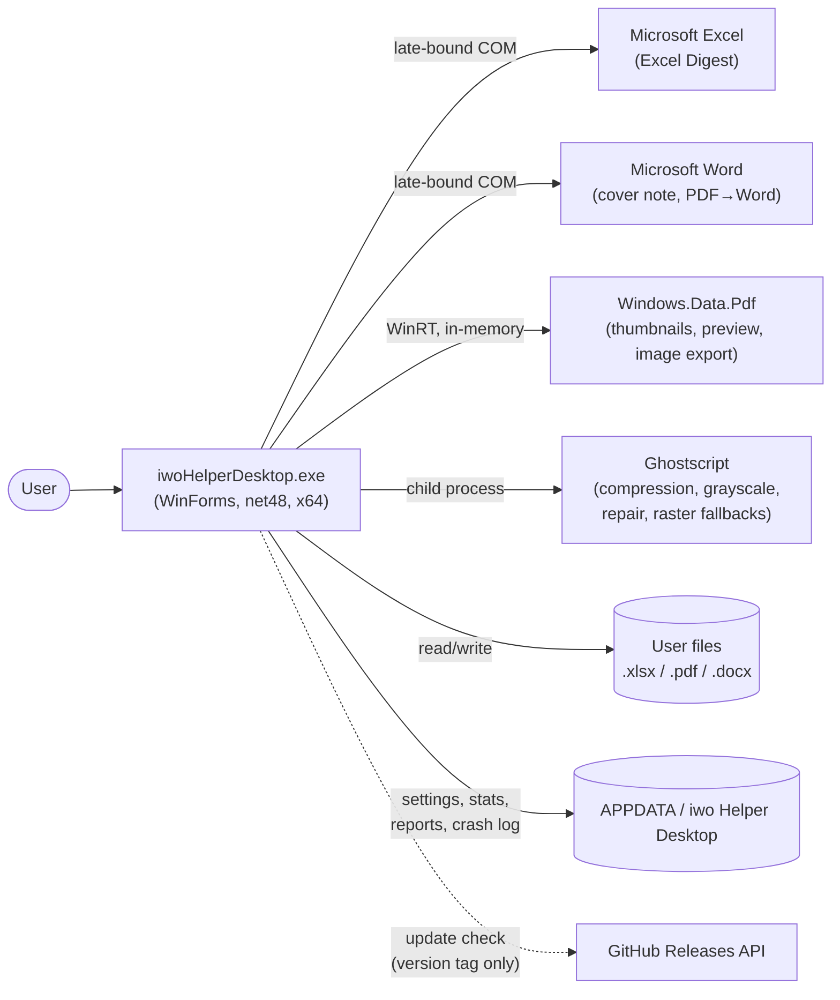
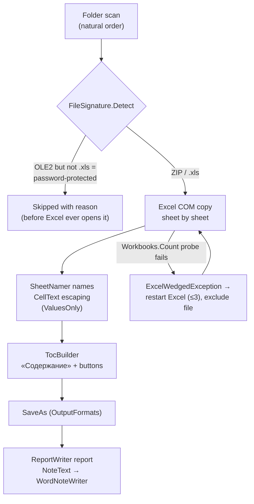
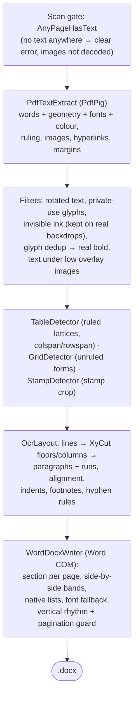

# Architecture

This document is the map of the codebase: what the application is made of, how the pieces
talk to each other, and which rules keep it working. It is written for someone about to
read or change the code. For **what the app does** (features, downloads, usage) see the
[README](../README.md), for the change history see the [CHANGELOG](CHANGELOG.md).

> **Maintenance policy:** this file describes the *shape* of the code — layers, pipelines,
> invariants. Update it when the shape changes (a new tool, a new pipeline stage, a new
> external dependency), not on every release.

## Contents

- [Bird's-eye view](#birds-eye-view)
- [System context](#system-context)
- [Tech stack and constraints](#tech-stack-and-constraints)
- [Code map](#code-map)
- [Architecture invariants](#architecture-invariants)
- [Tool pipelines](#tool-pipelines)
- [Office COM layer](#office-com-layer)
- [Threading model](#threading-model)
- [Error handling and resilience](#error-handling-and-resilience)
- [Persistence and privacy](#persistence-and-privacy)
- [Localization](#localization)
- [Testing](#testing)
- [Build, CI and release](#build-ci-and-release)
- [Repository layout](#repository-layout)
- [Extension points](#extension-points)
- [Key design decisions](#key-design-decisions)

## Bird's-eye view

iwo Helper Desktop is a single Windows Forms executable that hosts **six independent
offline tools** behind one start screen with two sections (PDF and everything else):

1. **Merge Excel** — merges sheets of every workbook in a folder into one digest (Excel COM).
2. **PDF Merge** — combines pages of several PDFs, copied as-is (PdfSharp).
3. **PDF Split** — extracts pages / splits by ranges, every N, or bookmarks (PdfSharp).
4. **PDF → Word** — rebuilds a born-digital PDF into an editable `.docx`
   (PdfPig extraction → own layout analysis → Word COM writing).
5. **PDF → PowerPoint** — turns the pages of a born-digital PDF into a `.pptx` whose text is
   real, editable text (same extraction, own OOXML writer, no PowerPoint required); everything
   that is not text arrives as the page background rendered without its text layer.
6. **More operations** — six actions over one document: compress, grayscale, repair, pages to
   images, text to `.txt`, document properties. Each writes a **new** file.

Cross-cutting services: optional **PDF compression** (Ghostscript as a child process),
page **thumbnails** (WinRT `Windows.Data.Pdf`), a Word cover note, reports,
usage counters and a history of what was produced and where, an update check (by button and
once at startup), an embedded user guide, and a Russian/English UI.

The guiding principles, in priority order:

- **Offline and private.** No telemetry, no background network. The only network call is
  the update check — by button, and once at startup unless switched off. Files are written
  only to user-chosen folders and `%APPDATA%`.
- **Zero footprint.** Target machines have nothing installed: .NET Framework 4.8 ships
  with Windows 10/11 (one-time install on Windows 8.1), Office is driven late-bound (no
  interop assemblies), managed libraries are embedded into the single exe, installs are
  per-user without admin. Both x64 and x86 packages are published.
- **Fidelity first.** PDF pages are copied without recompression, PDF → Word reproduces
  the source layout (columns, tables, spacing, fonts) rather than dumping plain text.
- **Survive real-world input.** Broken, password-protected and hostile files are detected
  up front, a wedged Excel is restarted, results are validated before replacing anything.
- **Logic lives in pure functions** so it can be unit-tested without Office (see
  [Testing](#testing)).

## System context

| Dependency | Kind | Used for | Needed by |
|---|---|---|---|
| Microsoft Excel | COM, late-bound | copying sheets with full formatting | Excel Digest only |
| Microsoft Word | COM, late-bound | writing `.docx` (cover note, PDF → Word) | Excel Digest note, PDF → Word |
| PdfSharp (MIT) | embedded assembly | PDF page copy for merge/split | PDF Merge/Split |
| PdfPig (Apache 2.0) | embedded assemblies | glyph-level text extraction | PDF → Word, text export |
| `Windows.Data.Pdf` (WinRT) | OS component (Windows 8.1+) | rendering pages | thumbnails, full-size preview, image export |
| Ghostscript (AGPL) | separate process | image downsampling, colour conversion, rewrite, raster fallbacks | compression (optional), grayscale, repair, PDF → Word raster fallbacks |
| GitHub Releases API | HTTPS, manual | latest version tag | update check only |

Excel and Word are **optional**: PDF Merge, Split and More operations run without any Office.

## Tech stack and constraints

- **C# 7.3 on .NET Framework 4.8, WinForms.** net48 is preinstalled since Windows 10
  1903 and installs once on Windows 8.1 (the installer checks), so target machines need
  nothing else. `LangVersion` is pinned — do not use newer syntax. The minimum OS is
  **Windows 8.1** — the oldest Windows with `Windows.Data.Pdf` (thumbnails).
- **Two explicit architecture builds, no AnyCPU.** The default build is x64
  (`dist\iwoHelperDesktop.exe`), `-p:Arch=x86` / `build.cmd x86` produces the 32-bit exe
  in `dist\x86\` with its own `obj\x86\` (a shared `obj` would let MSBuild's incremental
  clean delete the other arch's output). Office COM and Ghostscript run out-of-process,
  so the tool set does not depend on the app's bitness, a 32-bit process only halves the
  thumbnail document cache (~2 GB address space, each shown PDF is held in memory).
- **One exe.** All managed dependencies (`build/PdfSharp.dll`, `build/pdfpig/*` — 12
  PdfPig assemblies plus net48 polyfills such as `System.Memory`) are embedded as
  resources and resolved by name at runtime by `src/EmbeddedAssemblies.cs`. This also
  removes the need for binding redirects. Services that touch PdfSharp types call
  `EmbeddedAssemblies.Ensure()` first behind `[MethodImpl(NoInlining)]` gates, so the JIT
  never sees a library type before the resolver is registered.
- **Office through `dynamic`** (late binding, `Microsoft.CSharp`): no PIA/interop
  packages, builds on machines without Office, works with any Office version. The price
  is a set of strict usage rules — see [Office COM layer](#office-com-layer).
- **WinRT via `Microsoft.Windows.SDK.Contracts`** — compile-time only, the runtime
  projection is part of .NET Framework.
- Deterministic release build, no PDBs, output flattened to `dist\iwoHelperDesktop.exe`.

## Code map

Everything lives in a single project (`iwoHelperDesktop.csproj`, namespace
`ExcelMerger` — the historical name of the first tool). `src/` is flat, the layers below
are conceptual.

### Application shell

| File | Responsibility |
|---|---|
| `Program.cs` | Entry point. Parses CLI flags, installs `CrashReport`, initializes `Loc`, then runs the GUI (`ShellContext`) — or a headless mode: `--cli` (scripted Excel Digest), `--selftest` (create every window unshown), `--pdfcheck` / `--pdftextcheck` / `--thumbcheck` / `--gscheck` (embedded-dependency probes used by CI). Headless modes leave via `FastExit.Now`. The GUI path first claims the single-instance slot (`SingleInstance`); headless modes are checked earlier and always run, however many at a time. |
| `SingleInstance.cs` | One GUI process per user session. A named `Local\` mutex taken **without ownership** (nothing to abandon on a crash, and the name lives only as long as a handle is held) marks the running instance; a second launch broadcasts a `RegisterWindowMessage` signal and exits, so Task Manager shows one app instead of two. The signal is received by a hidden top-level window (`WS_EX_TOOLWINDOW`, never shown) — a message-only window would not do, broadcasts never reach those. The newly started process calls `AllowSetForegroundWindow` before signalling, otherwise Windows lets the running instance restore its window but not raise it. Any failure degrades to “start normally”. |
| `ShellContext.cs` | `ApplicationContext` that owns the hub and all tool windows (independent, non-modal). Reopens the hub, focuses an already-open tool, rebuilds windows on language change (active window last, busy windows deferred, each window put back through `WindowPlacement.Snapshot`/`ShowAt` so a minimized or maximized one returns exactly as it was), exits when the last window closes. Knows which **hub section** each tool was opened from (`HubLevel`) and hands it to the tool as its `Home` action, so “Home” returns to that section and not to the top screen — and carries the section over when the hub is rebuilt on a language change. Owns the `SingleInstance` listener (created before the first window, so a launch that follows immediately still finds it) and answers the signal with `ShowHub`, which is idempotent. |
| `ToolRegistry.cs` | Live-window registry keyed by tool id, prevents duplicate windows. |
| `StartForm.cs` | The hub, two levels deep (`HubLevel`): the main screen offers two sections, inside them live the tool cards (`pdf`, `split`, `ops`, `ocr`, `pptx` and `excel`) — the PDF section is laid out in three columns, because a third row would not fit a 1366×768 screen while a third column fits easily. The bottom row carries two icon buttons (gear → Settings, circled question mark → About): glyphs are drawn with grayscale antialiasing, since subpixel rendering fringes a small glyph on white, and each keeps a tooltip and an `AccessibleName` — an icon-only button has no other way to say what it does. The levels are **panels of one window**, not separate windows — `ShellContext` keeps a single hub and everything is wired to it. The window size is the same on every level so it never jumps, “Back” and `Esc` return to the top, and the focus is moved to the first card explicitly (otherwise it stays on a hidden control and the keyboard loses its place). PDFs dropped on the section card are held until a tool is picked (`_pending`, cleared on every exit from the section — a stuck set would open the next tool with someone else's files). |
| `IBusyAware.cs` | Marker for windows running a long operation (skipped by the language rebuild). |
| `FastExit.cs` | Hard process exit for headless modes — avoids WinRT finalization crashes on CLR unload. |
| `CrashReport.cs` | Global exception handlers: branded dialog on the UI thread, silent log otherwise, `%APPDATA%\…\crash.log` with size rotation. |
| `UserSettings.cs`, `AppPaths.cs` | `settings.txt` (language, remembered options, PDF zoom width and compression level) and all `%APPDATA%` paths. Fields owned by another window are never clobbered by a stale instance: `Save` re-reads zoom/compression from disk (the PDF tools write them explicitly via `SaveView`), the same way language is taken from the live `Loc`. |
| `UsageStats.cs` | Local operation counters in `stats.txt`, guarded by a cross-process mutex, optional auto-clear. |
| `OperationHistory.cs` | What was produced and where, in `history.txt`: paths and names only, never a copy. Same rules as the counters (own cross-process mutex), plus a ring of the last 200 entries and a sliding age limit. Reading only filters in memory — writing happens under the lock, so a second copy of the app cannot meet a half-written file. Pure `Escape`/`ParseEntry`/`Trim`/`KeepRecent` are unit-tested. |
| `SettingsForm.cs` | What belongs to the whole program rather than an open document: the startup update check and its manual button, and the history switch, age limit and clearing. Laid out from measured control sizes, not literals, and re-read on activation — a modal window over it can change the same settings. The three history actions share one row: the width is split evenly and a caption that does not fit is shrunk by font size (measured with the same padding the button paints with), never cut with an ellipsis — “Show” and “Clear” must not look alike. |
| `HistoryForm.cs` | The list itself, newest first, with “open” and “show in folder”. A window of its own because Settings is already as tall as the smallest supported screen allows, and because a list is not a setting. Existence is checked before opening: the path may have gone stale. |
| `UpdateChecker.cs` | Manual check: reads the latest release tag from the GitHub API, compares, and on a newer version asks before opening the Releases page (`Ui.OpenUrlOrShow`, which shows the address when no browser can be started — a swallowed failure would answer “Yes” with nothing at all). Downloads and installs nothing. Pure `ParseTag`/`IsNewer` for tests. |
| `Loc.cs`, `Flags.cs` | Localization catalog and GDI-drawn menu flags — see [Localization](#localization). |
| `SetupLanguage.cs` | The language picked in the installer. Setup writes a one-line ASCII file next to the settings, the app applies it at startup (it outranks the stored language), saves it the normal UTF-8 way and removes the marker. Setup never edits `settings.txt` itself: it writes text in the system code page while the app reads UTF-8, and a read-modify-write would corrupt non-ASCII paths inside. |
| `UserManual.cs` | The user guide (`.docx`) embedded as a resource: unpacked next to the settings on demand and opened from “About”. Embedded rather than installed so the portable build has it too, and so it needs no internet. |
| `Theme.cs`, `Ui.cs`, `HelpMenu.cs` | Palette, DPI/layout helpers, the shared ☰ menu. Menus are drawn with the **application** font rather than the system menu font: the strip has a fixed height, while the system font size is a separate Windows setting, and that combination clipped the captions. Every window sets its own font too, so that setting cannot reach the layout anywhere else. |
| `JustifiedText.cs` | A paragraph justified to both margins — WinForms offers left, right and centre only, so the alignment is set on the paragraph format through `EM_SETPARAFORMAT`. Shared by About and Settings; re-applied on every handle creation, because WinForms recreates the window and a one-time setup would be lost. |

### UI toolkit (owner-drawn, shared by all tools)

`HeaderBand` (gradient window header — the title block is centred vertically in the band and
child controls are aligned to that block, from measured font heights rather than literals), `ChoiceCard`, `RoundedButton`, `AccentCheckBox`,
`WindowChrome` (title-bar colouring), `WindowFlasher` (completion
flash), `TaskbarProgress` (`ITaskbarList3`), `MessageForm`/`Dialogs` (branded message
boxes), `NumberPromptDialog` (Ctrl+G / “move after page…”, sized to its prompt),
`AboutForm`, `StatsForm`, `FolderPicker`, `CompressionPicker`, `ThumbZoom` (tile sizing,
DPI render width, page-cache capacity). Shared fonts and the app icon are cached per
process by `Ui` (WinForms never disposes `Control.Font`/`Form.Icon`).

`ChoiceCard` measures its own contents and centres the icon-title-description block in the
card, so cards with descriptions of different lengths still look alike, and `RoundedButton`
has three looks (`Primary`, `Secondary`, `OnDark`) with a **filled** disabled state — a panel
where half the buttons wait for an open document must show that without being clicked.

`Ui` also owns the pieces every window would otherwise copy: `InitDialog` (the modal-dialog
frame — title, icon, fixed border, centring, DPI scaling), `RoundedRect` (the one
rounded-rectangle outline behind every owner-drawn control), `Ellipsize` (a variable-length
label that shortens with “…” instead of running off the edge), `OpenPath`/`OpenPathOrWarn`/
`OpenUrlOrShow` (the three ways to hand something to the shell: silently for a result the
user already has, with a dialog for an explicit action, and with the address shown for a
browser that will not start), `SelectAllItems`, and `HeaderLastInTabOrder`. That last one is called from `OnLoad`, not at construction:
`ControlCollection.Add` hands each new control the next free `TabIndex`, so a high index set
on the header while building would put it *first* and land the focus on “Home”.

### Excel Digest

| File | Responsibility |
|---|---|
| `MainForm.cs` | Tool window: folder/output pickers, the one file list (order + per-file results), progress, report/note actions. |
| `MergeService.cs` | The engine (UI-free). Owns the Excel instance and the whole run: pre-filtering, per-file copy, retry of skipped files, self-healing restarts. Defines `MergeOptions`, `MergeResult`, `MergeException` (user-facing, localized), `ExcelWedgedException`. |
| `SourceFileList.cs`, `ListReorder.cs`, `NaturalStringComparer.cs` | File list model, reorder ops, Explorer-style ordering (`StrCmpLogicalW`). |
| `FileSignature.cs` | Container sniffing (ZIP / OLE2 / other) — rejects broken and password-protected files *before* Excel opens them. |
| `SheetNamer.cs`, `CellText.cs`, `OutputFormats.cs` | Legal/unique sheet names (31 chars, `_2` suffixes), cell-entry escaping, `XlFileFormat` mapping. |
| `TocBuilder.cs` | The «Содержание» sheet: hyperlinked table of contents, per-sheet return buttons, frozen header. |
| `ReportWriter.cs` | Plain-text run report, keeps the three latest in `%APPDATA%\…\reports`. |
| `NoteText.cs`, `WordNoteWriter.cs` | Cover-note content (pure) and its rendering through Word COM. |

### Office COM infrastructure

| File | Responsibility |
|---|---|
| `ComSafe.cs` | `Release(object)` / `Collect()` — deterministic RCW release. |
| `ComMessageFilter.cs` | `IOleMessageFilter` that auto-retries `SERVERCALL_RETRYLATER` (busy Excel, AV scans) instead of surfacing `RPC_E_CALL_REJECTED`. |
| `WordCom.cs` | The one place that starts/quits Word and hosts the write-a-docx skeleton shared by `WordNoteWriter` and `WordDocxWriter`. |

### PDF: shared plumbing

| File | Responsibility |
|---|---|
| `EmbeddedAssemblies.cs` | Runtime resolver for the embedded PdfSharp/PdfPig assemblies. |
| `PdfToolFormBase.cs` | Base class of all PDF tool windows: thumbnail grid, zoom slider with an editable “%” box (`ThumbZoom.Percent`/`WidthFromPercent`, two-way-synced with the slider without drift, `Ctrl+0` or a double-click on “%” resets to 100%) and Ctrl+wheel over the slider, compression picker, status/progress strip (with a per-page counter and a selection counter — pure `ProgressItem`/`RestingStatus`, plus the pure `SuccessStatus`/`CompressedPart` pair that assembles every “done” line, so the catalog stores bare fragments while the ✓, the « · » separators and the closing period live in one place), drag-and-drop, a keyboard-shortcuts cheat sheet built from the grid's capabilities (`BuildShortcuts`), the shared grid hotkeys (`ClassifyPageKey`: Ctrl+A/X/C/V/Z/Y/G, Alt+←/→, Delete, Esc, Ctrl+Shift+«+»/«−»), background-work lifecycle. The zoom slider and the percentage share the row with the compression picker on the right, both right-anchored so a constant gap keeps them apart at any width (the slider stretches). Remembers the last zoom width and compression level between runs (`SaveView`, restored in `BuildBottomStrip`). Cooperative cancellation of long operations (`ShouldOfferCancel` ≥ 5 pages): a Cancel button overlays the action button (`CancelToken` → a `volatile` flag the worker polls), withdrawn at the point of no return once the output is committed (`StopOfferingCancel`, wired through to the PDF → Word writer). Background work is marshalled through the shared `Ui.OnUi`/`Ui.RunWorker` (one guarded `BeginInvoke` helper, no per-form copies), `SyncControls` is the abstract per-form hook that reflects the current state (operation, background parse, selection) on the buttons and grid lock, and `FinishOperation` is the shared epilogue: it ends the operation and tells the form whether there is a result worth showing, so cancellation and failure are worded and dialogued in one place. `BeginIndeterminate` switches the bar to a marquee for a phase whose progress cannot be measured (Ghostscript compression runs in its own process and reports nothing) — a full bar with Cancel already withdrawn reads as a hung window. Adding/opening a PDF parses it on a worker (`BeginLoad`/`EndLoad`, `Working` = busy or loading) so a large or network file never freezes the window. Forms open with dropped files via `IFileAcceptor` (drop onto a start-screen `ChoiceCard`, `WireFileDrop` is the shared window drop handler). Each window's size and position persist per form via a single `WindowPlacement.Attach` in `InitShell` (clamped onto a visible screen), which is why closing a busy window — it returns before calling base — saves nothing. |
| `PdfSingleDocFormBase.cs` | Base of the two tools that work with ONE open document — **PDF Split** and **More operations**. Owns the whole “open a file and show its pages” layer once: the file dialog, the background parse, filling the grid, the status, accepting a file dropped on the window, on the grid or from a start-screen card (`IFileAcceptor`), and the “selected pages, or all of them if none” rule that every operation needs. |
| `PdfOpsForm.cs` | **More operations**: six actions over one document (compress, grayscale, repair, pages to images, text to `.txt`, document properties), grouped by what they do. Every action writes a **new** file — sources are never modified — and the three copy-then-transform ones share one method. The window has no single action button, so it tells the base where to draw “Cancel” (`RegisterCancelArea`) instead of handing it a button to replace. Merge and Split reach it through one bridge (`PdfToolFormBase.OpsBridge`, an `Action<string>` the hub supplies): the path is the document to hand over, an empty one just opens or raises the window. The hub is the composition root — the tools do not reference each other. |
| `PdfOrderedToolFormBase.cs` | Base of the two tools that assemble one result from pages of several files — **PDF Merge** and **PDF → Word**. Owns the `PdfPageOrder` model and the entire “order ↔ grid” layer once (add files, reorder, cut/copy/paste move, delete, undo/redo, grid + file-drop wiring), the concrete forms keep only their buttons, their action worker and a `SyncControls` override (`PickAndAddFiles` — the “choose PDFs” dialog — lives here too). |
| `PdfPageGrid.cs`, `PdfPageOrder.cs` | The thumbnail grid subsystem, OWNER-DRAWN (tiles, number captions, selection, cut-dimming and the rotation badge are painted in `DrawItem`, `LVM_SETICONSPACING` sets the cell, so zoom goes to 400 px past the ImageList limit — an empty metrics ImageList keeps native hit-testing honest and clicks on the outer ring of big tiles are compensated). Lazy visible-only rendering with a larger re-render on deep zoom, an in-window page buffer (cut/copy/paste) with an insertion caret and a hover hint, drag reorder with edge auto-scroll, file drop with an insert position, per-page and whole-document rotation, «Move after page N…», a context menu, `Locked` gating during operations. Owner-draw paint allocates nothing per frame: fill brushes and border pens are process-wide statics, glyph fonts come from the shared `Ui.Font` cache, and the selection tint is cached and rebuilt only on a system-colour change. Ctrl+wheel zoom is coalesced through the slider's throttle (`WheelBasis`) so a fast spin keeps every step. Hovering a tile shows ↺/↻ rotate chips on it. Double-click routing is a pure decision (`ClassifyDoubleClick`, precedence rotate chip → number strip → tile): a hover rotate chip swallows the event so a quick double-click on ↺/↻ turns a full 180°, else the number strip under a tile (`IsOnLabel`) opens «Move after page…», else the tile opens a full-size page preview (`PagePreviewForm`). The page-order model (`PdfPageRef` = source file + page index + rotation) is shared by merge and PDF → Word and keeps undo/redo stacks (Ctrl+Z / Ctrl+Y) of order-plus-rotation snapshots (`BeforeRotate` lets the form checkpoint before the grid mutates angles), the grid mutates only `Rotation` of the shared refs and requests order changes via events. |
| `PdfThumbnailRenderer.cs`, `LruCache.cs` | WinRT rendering **from memory** (see invariants) at a DPI-scaled width, LRU of open documents (6, halved on x86) and a byte-budgeted LRU of rendered pages (192 MB, 48 MB on x86) — an evicted page re-renders when shown again. |
| `PagePreviewForm.cs` | Modal full-size preview of one page (double-click a tile). Renders on its own background thread with a private `PdfThumbnailRenderer` (single-threaded); the worker returns the page **unrotated** and the UI thread applies the angle, so a render that arrives after the user has turned the page is still correct. A right-click opens rotate right/left (plus the grid's own Ctrl+Shift+«+»/«−» through the shared `ClassifyPageKey`), and the rotation is delegated to a callback the grid passes in — it runs through `RotateItems`, so the undo checkpoint, the tile-cache pruning and the thumbnail repaint all happen exactly as they do in the grid. The shown bitmap is turned in place by the difference between the wanted and the already-applied angle (90° steps are lossless, so no copy and no re-render). A zoom bar (− / % / + / “fit to window” / “Print”) and `Ctrl`+wheel scale the page: the wheel is caught as an `IMessageFilter` because Windows delivers it to the focused control and the scrolling viewport would swallow it, and the zoom is anchored so the point under the cursor stays put (`PreviewZoom.Anchor`). Once the page is bigger than the window it is dragged with the hand cursor (`PreviewZoom.IsDrag` separates a drag from a shaky click). A click does **not** close the window — the surface is now used for panning — `Esc` and the close button do. Size and position persist via `WindowPlacement`; the bitmap is disposed on close, the message filter is removed in `OnFormClosed` (it would otherwise hold the window alive) and a late render is dropped if the window is already gone. |
| `WindowPlacement.cs` | Remembers each window's size and position between runs (keyed by form type name), restored clamped onto a visible working area so a window never opens off-screen or on a disconnected monitor, keeping the maximized state. `Attach` is the only entry point — one line in a window's constructor wires both halves through the `Load` and `FormClosing` events, so a window needs no overrides of its own and the pair cannot be half-removed (restoring and saving are `private`). A window that vetoes its own close leaves its override before calling base, so the event never fires and nothing is saved. Meant for **resizable** windows: a fixed-size one could be handed bounds that no longer suit the current display scale. `NormalBounds` is the single rule for “where does this window sit when it is not minimized or maximized” — a minimized window reports a position far off every screen (-32000, -32000), so anything that copies raw `Bounds` parks the window past the edge of the desktop. `Snapshot`/`ShowAt` package that rule with the window state for `ShellContext`, which reuses it to rebuild windows on a language change instead of keeping its own version. Pure `ClampToWorkingArea`/`Format`/`TryParse` are unit-tested, the wiring is covered by a live test that opens the real windows, and the store lives in `UserSettings` (read-modify-write, so one window never clobbers another's bounds). |
| `Cancellation.cs` | Both halves of cooperative cancellation. `ThrowIf(Func<bool>)` throws `OperationCanceledException` when the flag is set, and services call it between work units. `NoPartialOutput(...)` holds the other half of the promise — **a cancel leaves nothing behind**: a service that writes one file per unit of work (split parts, exported page images) registers each file as it lands, and the wrapper deletes them before the cancel travels on, while a service that writes a single file simply saves at the very end. It is a wrapper rather than a `catch` per site because the same block sat in all three split modes and was missing from the fourth writer, which is how a cancelled image export came to leave half the pages in the folder. An **error** is deliberately not the same case: what was written before a failure stays. |
| `Ghostscript.cs` | Locates gs (bundled → registry → `Program Files` → user profile → `PATH`) and runs it with a timeout. |
| `PdfCompression.cs` | `pdfwrite` downsampling (`/ebook`, `/screen`), PDF 1.4 output, the result replaces the original only if it is a valid PDF **and** strictly smaller. `ImageDpi` is the single place that knows what each preset does to images (150 and 72 dpi, the values Ghostscript itself sets in `Resource\Init\gs_pdfwr.ps`) so the result messages can name it. Only raster images are downsampled — text and vectors are never rasterized, which is why the wording is “images to N dpi” and not “compressed at N dpi”. |
| `PageRasterizer.cs` | Renders a page region to PNG via gs — the raster fallback used for soft-masked images and rasterized regions. |
| `PdfExportService.cs`, `PlainText.cs` | Export out of PDF: pages to PNG/JPEG at a chosen dpi through the same renderer as the thumbnails, and the text layer to `.txt`. Images are the one export that writes a file per page, so it runs inside `Cancellation.NoPartialOutput`. `PlainText` is the pure half — it merges paragraphs **and tables** back into reading order by vertical position, because the analysis moves table words out of the paragraph stream and a naive dump loses them. |
| `PdfConvert.cs`, `GsRewrite.cs` | Grayscale and repair through Ghostscript. `GsRewrite` is the pipeline both they and compression share: run, validate, replace only when the caller's policy allows, restore the original on any failure. Compression replaces only a **smaller** file, the conversions replace any sound one. |
| `PageInterleave.cs` | Pure interleaving of the page order — assembling the two stacks a single-sided scanner produces (fronts, and backs in reverse). |
| `NameTemplate.cs`, `OutputFile.cs` | Output names: pure token substitution (`[BASENAME]`, `[FILENUMBER###10]`, …) and the one place that picks a free file name. |
| `PreviewZoom.cs` | Pure zoom and pan maths of the full-size preview: the step ladder, fit-to-window, the scroll offset that keeps the point under the cursor in place, and when a click closes the window. |
| `PdfDrop.cs`, `PageRanges.cs`, `PdfProbe.cs` | Drag-and-drop extraction, `1,3-5`-style range parsing, a tiny generated PDF for self-checks. |

### PDF Merge and Split

`PdfMergeForm` / `PdfMergeService` (load page sizes, copy pages as-is in shown order),
`PdfSplitForm` / `PdfSplitService` (extract selection, split by ranges / every N /
top-level bookmarks). Both compress optionally and never modify the source. Both are
cancellable during page assembly (the page count drives the ≥ 5 threshold), the optional
Ghostscript compression that follows runs past the point of no return and is not interrupted.

### PDF → Word pipeline

| File | Responsibility |
|---|---|
| `OcrForm.cs` | Tool window: multi-file thumbnail grid, cross-file page ordering, convert action. |
| `PdfToWordService.cs` | Orchestrator: scan gate (`AnyPageHasText`), per-source extraction cache, page assembly in shown order, progress split extraction/writing. The single point where a scanned-PDF (OCR) branch would plug in later. |
| `PdfTextExtract.cs` | PdfPig-based extraction to `PdfPageText`: words with geometry/font/colour, ruling lines, images, hyperlinks, page margins. Filters: rotated text, private-use glyphs, invisible ink (kept on real backdrops), doubled glyphs → real bold, text under low overlay images. Detects a text-drawn stamp and carries it as a rendered crop. A user page rotation from the grid is applied HERE, before any layout analysis: the orientation filter keeps the text that becomes horizontal, `PageRotation` transforms words/ruling/images (bounds and pixels) and swaps the page dimensions, raster crops are inverse-mapped into the source space. |
| `PageRotation.cs` | Pure page-space rotation math (points, boxes, PNG pixels, H↔V ruling, dimension swap) shared by the extraction pipeline and the grid tiles. |
| `OcrLayout.cs` | Layout analysis: words → lines → blocks → paragraphs (`OcrParagraph`/`OcrRun`). Every word carries the start of its **baseline** alongside its ink box, and a line takes the median of its words' — a superscript sits on its own baseline and would pull an average off. The coordinate-driven writers place text and measure line spacing by it. Paragraph boundaries (gaps, indents, short lines, list markers, deliberate hard breaks), alignment classification (left/justify/centre), per-paragraph first-line indents, super/subscript and footnote marks, Cyrillic-aware hyphenation rules. Where the file carries **document structure** (`StructureBlocks.cs`), those boundaries are corrected by it: two lines the author put in one block are never split. The correction only ever **removes** a break, never adds one — a producer that marks every line separately then changes nothing instead of fragmenting further — and geometry keeps a veto for lines that turn out to be far apart. |
| `XyCut.cs` | Recursive X-Y cut: whitespace bands split a page into floors and columns, `OrderTree` keeps side-by-side siblings marked for band layout. |
| `TableDetector.cs` | Ruled tables: connected ruling components on a spatial grid, ≥2×2 cell lattice, colspan/rowspan from missing borders, per-cell text. Also turns lone rules into `____` placeholders and feeds `UnderlineDetector`. |
| `GridDetector.cs` | Unruled label/value grids (receipt-style forms) → borderless tables with kept row spacing. |
| `StampDetector.cs`, `ListMarker.cs`, `UnderlineDetector.cs`, `GlyphDedup.cs`, `FontNames.cs`, `MathUtil.cs`, `OcrTable.cs`, `PdfLine.cs` | Focused helpers: stamp region, list-marker recognition, underline mapping, glyph dedup, font-name normalization, medians, table/line models. |
| `WordDocxWriter.cs` | Writes the `.docx` through Word COM: a section per PDF page (size, orientation, margins), zeroed Normal style, `OrderTree`-driven side-by-side bands and `CoalesceRowBands` as borderless tables, native Word lists (start value set on the document's own list template), fonts normalized with an installed-font fallback to Times New Roman (keeps Cyrillic off the East-Asian justification path), source vertical rhythm with a `FitSpacingToPages` pagination guard. |

### PDF → PowerPoint pipeline

Everything up to `PdfPageText` is the pipeline above — the parse layer knows nothing about
the output format. The `.pptx` differs only in what happens after it.

| File | Responsibility |
|---|---|
| `PptxForm.cs` | Tool window — a 40-line specification on top of `PdfConvertFormBase`. |
| `PdfConvertFormBase.cs` | The window shared by both converters (grid, ordering, printing, progress with cancel, error wording, history and counters). What differs between the tools lives in `ConvertToolSpec`: catalog prefix, colour, extension, STA requirement, the convert delegate. |
| `PdfPageExtraction.cs` | The first half of any “PDF → document” conversion, shared with the Word path: unique sources, scan gate, rotations, per-source extraction, assembly in shown order. |
| `PdfToPptxService.cs` | Orchestrator: parse (in `PageLayoutMode.Slide`) → page backgrounds → write, progress split three ways, result written to a temp file and moved last so a cancel leaves nothing behind. No COM, so no STA thread. |
| `PageLayoutMode.cs` | What the parser does differently for a flow output and for an absolutely-positioned one. For a slide: **every source line becomes its own paragraph** (a slide cannot re-flow text — another engine breaks lines by its own metrics, while underlines and rules arrive in the background and stay where they were, so they would start crossing the letters); a single-line row is further split at wide gaps (a row of chart labels must not collapse into one box); lone ruling lines do **not** become `____` placeholders (a flow writer has no other way to draw a line, a slide gets the real one); a text-drawn stamp is **not** flattened into an image (its text must stay text). |
| `PageBackgrounds.cs` | Page rendered **without its text** (`-dFILTERTEXT`, one Ghostscript run per source file): DPI by page count, blank pages dropped, user rotation applied, media budget. Missing Ghostscript degrades silently to a text-only deck. |
| `StructureBlocks.cs` | Which logical block (paragraph, list item, cell) each letter belongs to, read from the marked content of a **tagged PDF** (ISO 32000 §14.7 — Word, PowerPoint and Acrobat all write it). Only the block number is taken: it answers “are these two lines one paragraph”, which is the whole question. The roles live in the structure tree and are not needed for that. The `Artifact` flag is deliberately **not** used to drop text — on real files it turns out to be set on visible text, and trusting it would erase content. |
| `PptxWriter.cs` | Model → slides: paragraph → text box (zero insets, autofit off, no wrap, box placed against the **baseline** of the first line so the letters land where they were — the factor is measured against real PowerPoint, and the baseline is used rather than the top of the ink because that top depends on whether the line has capitals at all; the first line is given no exact spacing of its own, because an exact spacing describes the distance *between* lines and not the place of the first one), run → `a:r` (size, weight, colour, font, super/sub, hyperlink), table → `a:tbl` with merge flags, background → slide background (or a locked picture when the page had to be scaled to fit). Every line of a paragraph carries **its own indent** from the box edge and the paragraph is set flush left: the box is one per paragraph and its width is known only to within the slack allowed for another engine's metrics, so centring a line inside it would place it by that inexact width. The indent places it exactly. Embedded images are placed **only when the page has no background**: the background is the page without its text, so it already contains them — drawing them twice would double the file and make “delete the picture” a lie. |
| `PptxGeometry.cs` | Units and axes: points → EMU, Y flipped from page height, slide size by the most common page size, `SlideFit` scaling and centring for pages that differ from it. |
| `PptxParts.cs`, `OoxmlPackage.cs`, `XmlText.cs` | The format itself: constant parts (theme, master, blank layout), relationship files, and the OPC packaging rules — content types first in the archive, part names without a leading slash inside it and with one in `[Content_Types].xml`, UTF-8 without BOM. `XmlText` strips what XML cannot carry (control characters, unpaired surrogates) before escaping. |
| `RasterUtil.cs` | Shared raster checks: “is this image blank” and “PNG or JPEG, whichever is smaller” (transparency detected by content, not by pixel format — otherwise nothing is ever recompressed). |

> Naming note: the `Ocr*` files predate the feature's final shape — the tool handles
> **born-digital** PDFs, no OCR happens today. The orchestrator comment marks where a
> real OCR branch would attach.

## Architecture invariants

- **Services are UI-free and forms are logic-free.** Forms gather input, start a worker,
  render progress/results. Everything decidable is a pure static function under unit
  tests, everything with side effects lives in a `*Service`/writer class.
- **All Office COM sits behind `MergeService` / `WordCom`** with `ComSafe` +
  `ComMessageFilter`. Forms never touch COM objects.
- **COM calls run on dedicated STA worker threads**, never on the UI thread and never on
  thread-pool (MTA) threads.
- **WinRT PDF documents are always loaded from memory** (`InMemoryRandomAccessStream`),
  never from a file path: `LoadFromFileAsync` keeps the file memory-mapped, which would
  make a shown file impossible to overwrite (`ERROR_USER_MAPPED_FILE`).
- **Sources are never modified.** Every tool writes new files, compression replaces its
  own output only after validation. Page rotation is a property of the page **in the
  model** (`PdfPageRef.Rotation`) — it is composed with the page's own `/Rotate` when
  the output is written, never applied to the source.
- **Thumbnail memory is bounded.** Rendered pages live in a byte-budgeted LRU (halved
  in a 32-bit process), tile keys include the rotation, so duplicated pages can carry
  different rotations. An evicted page silently re-renders when scrolled into view.
- **User-visible strings go through `Loc.T`** (both languages), *generated documents*
  (cover note, TOC sheet, reports) are deliberately Russian regardless of UI language.
- **No new runtime dependencies** unless embedded as a resource and MIT-compatible,
  AGPL code (Ghostscript) is only ever invoked as a separate process.

## Tool pipelines

### Excel Digest

Resilience is the point of this pipeline: signature pre-filtering keeps poisonous files
away from the shared Excel instance, `ComMessageFilter` absorbs busy-server rejections,
a responsiveness probe between files catches a wedged Excel, which is then restarted
with the offending file excluded, skipped files can be retried later without a full
rebuild (`RetrySkipped` merges old and new results). All failure reasons flow as one
wording into the list UI, the report and the cover note.

### PDF Merge and Split

PdfSharp opens sources read-only and copies page objects as-is — nothing on the page is
re-encoded. The thumbnail grid renders through WinRT in a background
thread with an LRU document cache, merge writes pages in the exact shown order (across
files), split writes selections/ranges/every-N/bookmark chapters. User-assigned page
rotation travels with the page: merge reads it from each `PdfPageRef`, split takes a
rotation map keyed by source page index (one convention for all four modes), and both
compose it with the page's own `/Rotate` in the output. Optional Ghostscript
compression runs per output file with validation before replacing.

### PDF → Word

Two decisions define this pipeline:

- **Geometry over text order.** PdfPig yields glyphs in drawing order, which is
  meaningless for layout. Everything the writer needs — reading order, columns,
  paragraphs, tables, alignment — is *re-derived from coordinates* (X-Y cut, gap
  statistics, edge alignment), with thresholds expressed in em/font-size units so they
  scale with the document.
- **Word writes the document.** The `.docx` is produced by Word itself (COM), not by
  emitting OOXML: Word owns list numbering, spacing and font substitution, so the result
  behaves natively when edited — and the app needs no OOXML library.

### PDF Compression

`Ghostscript.Exe` resolution order: bundled (`<app>\gs\bin`, from the installer) →
registry → `Program Files\gs` → user profile → `PATH`. Arguments produce PDF 1.4 via
`pdfwrite` with `/ebook` (~150 DPI) or `/screen` (~72 DPI), `-dSAFER`, bundled runs get
explicit `-I` resource paths. The output replaces the target only if it is a valid PDF
and strictly smaller — an already-optimized file is left untouched.

## Office COM layer

Late-bound COM is powerful and unforgiving, these rules are load-bearing:

- **Store the reference as `object` before `Close`/`Quit`.** Any `dynamic` operation on
  a closed COM object throws `COMException 0x80010114` *at bind time* — before entering
  the method, past your `try`. Release through `ComSafe.Release(object)`.
- **Always `Quit()` + `Release` + `ComSafe.Collect()` in `finally`.** A leaked
  `EXCEL.EXE`/`WINWORD.EXE` keeps running headless and can wedge every later COM call on
  the machine.
- **Register `ComMessageFilter` around COM work.** It retries `SERVERCALL_RETRYLATER`
  (up to ~20 s) instead of failing with `RPC_E_CALL_REJECTED` when Excel is busy or an
  antivirus is scanning.
- **Escape all text entering cells** through `CellText.EscapeForEntry`/`EscapeValues` —
  a value starting with `=` becomes a formula, a leading `'` silently disappears.
- **Wait for readiness under load** (`WaitExcelReady` polls `Workbooks.Count`) — a
  freshly started Excel may reject calls for seconds.

## Threading model

- **UI thread** — WinForms only, results marshalled back via `BeginInvoke`, progress
  callbacks throttled, taskbar progress mirrors the in-window bar.
- **STA worker threads** — one per Office job (merge, note, PDF → Word write): COM
  apartments require it.
- **Thumbnail thread** — one background renderer per grid with a work queue, joined
  (with a timeout) before the form disposes. The page-preview window renders on its own
  short-lived background thread.
- **Cooperative cancellation** — the UI thread sets a `volatile` flag, the worker polls
  it between work units (`Cancellation.ThrowIf`) and unwinds cleanly. No thread is aborted.
- **Cross-process safety** — `stats.txt` increments run under a named mutex, so two app
  copies don't lose counts.
- **Headless exits** — CLI/self-check modes end with `FastExit.Now` to skip WinRT
  finalizers that can crash CLR unload.

## Error handling and resilience

- `MergeException` — the user-facing error type: localized message, no stack trace shown.
- Transient vs permanent open failures: `IsPermanentOpenError` stops pointless retries
  (wrong password, corrupt file) while `SERVERCALL_RETRYLATER`-class errors retry.
- `CrashReport` catches everything unhandled: a branded dialog on the UI thread, a
  silent entry otherwise, `crash.log` rotates by size.
- External results validated before commit: compression output must parse as PDF and be
  smaller, reports rotate (3 latest), low-disk-space stops a merge up front.

## Persistence and privacy

Everything lives under `%APPDATA%\iwo Helper Desktop`: `settings.txt` (language,
remembered options, PDF zoom width and compression level), `stats.txt` (local counters,
optional auto-clear), `reports\`
(three latest merge reports), `crash.log`, `setup-language.txt` (the language picked in the
installer, applied and deleted on the first start) and the user guide unpacked from the exe
when “About → open” is used. Nothing else is written outside user-chosen
output folders. The only network code is `UpdateChecker` — a manual GET of the latest
release tag, it opens the browser rather than downloading. Details: [PRIVACY](PRIVACY.md).

## Localization

`Loc` holds the entire catalog (`key → [ru, en]`) in code, `Loc.T(key)` resolves at
paint time, `Loc.Set` persists the choice and raises `Loc.Changed`. `ShellContext`
rebuilds open windows on the event (deferred via `BeginInvoke`), recreating the active
window last so z-order is kept, windows implementing `IBusyAware` are left alone until
their operation finishes. Menu flags are drawn with GDI (`Flags`) because WinForms
renders emoji flags as letters. Generated documents intentionally stay Russian (see
invariants).

## Testing

The pyramid, bottom-up:

1. **Unit tests** — `tests/UnitTests.cs` (301 tests, custom exe runner, zero
   dependencies, no Office) covering the pure core: layout analysis, table/grid/stamp
   detection, X-Y cut, list markers, naming/escaping/ranges, tag parsing, spacing rules,
   zoom percentage and wheel-step chaining, the number-strip hit-test and double-click
   classification, the preview's centring and zoom maths, the card's content centring, the
   button metrics, the cancel threshold, live merge/split cancellation (throws and leaves
   no file), and settings that survive a stale writer (in an isolated `AppPaths` root).
   The runner leaves through `FastExit.Now` for the same reason the app's headless modes do:
   the live-window tests touch WinRT, and a normal process unload dies in
   `DLL_PROCESS_DETACH` *after* every check has passed — a green run with a non-zero exit
   code, which stops the release pyramid on a step that actually succeeded.
   Also the invariants that guard shipped bugs: the compression resolutions match the
   Ghostscript presets, the rotation delta lands on the wanted angle from any starting
   angle, Ghostscript's zero exit code is not trusted when its error stream carries the
   engine's own marker, drag hints stay imperative and name the drop target, every `Loc`
   key used in code exists in the catalog (and no catalog key is orphaned), and the
   single-instance name is taken once and freed on exit.

   A dozen tests build **real windows** on an STA thread with the settings redirected to a
   temporary folder (`InIsolatedSettings` — live windows save their bounds on close, and
   without the redirection a test would overwrite the user's own settings). They cover the
   About window (description selectable, justified, not clipped, copyright bottom-left,
   both languages, because the texts wrap differently), every window in English (no stray
   Cyrillic, read-only text boxes included, since those are labels the user can copy),
   window-position memory (each window is opened, moved and closed for real, with a control
   case proving an unattached window saves nothing — the wiring is one line and its loss
   would be silent), the hub (navigating between its levels, every card really opening its
   tool, held files cleared on the way out, and a language change survived while
   **minimized**, whose placement must come back on-screen rather than at the off-screen
   coordinates a minimized window reports), both bridges into “More operations”, the
   preview's minimize box coming with a taskbar button, and the shared dialogs' layout.
   Two more squeeze every tool window to its **minimum size** and require that no control
   leaves the window and no two buttons overlap, and that the header (which carries “Home”)
   is **last** in the tab order — both defects those checks describe were live when they
   were written. One more measures every button caption in the button's **own font** and
   fails if it would be cut with an ellipsis: clipping is silent, and it had already shipped
   in a dialog whose primary button is set larger and bold than the window it lives in. Run by `tests\build_tests.cmd [x86]`, and CI runs both
   architectures because cache sizing branches on `IntPtr.Size`. The runner also fails if
   the number of checks drops below a floor, so a deleted `Run(...)` line cannot slip by.
2. **Self-checks in the exe** — `--selftest` (every window created headless),
   `--pdfcheck` / `--pdftextcheck` / `--thumbcheck` / `--gscheck` (embedded PdfSharp,
   embedded PdfPig extraction, WinRT thumbnail render from memory, Ghostscript
   round-trip). CI runs each as a separate step.
3. **Integration** — `tests/verify*.ps1` drive the real exe against generated corpora
   and assert on the produced `.xlsx`/`.docx`/`.pdf` (PdfPig-based checks included).
   They need installed Excel/Word, so they run locally only: `tests\run_all.cmd` — the
   full pyramid plus a zombie-process check at the end.

The working rule: new logic lands as pure functions with unit tests, behaviour that
needs Office gets a `verify` script.

## Build, CI and release

- **Build:** `build.cmd [x86]` → `dotnet build -c Release [-p:Arch=x86]` → single
  `dist\iwoHelperDesktop.exe` (x86: `dist\x86\iwoHelperDesktop.exe`), embedded resources
  included. Needs only the .NET SDK.
- **CI** (`.github/workflows/ci.yml`, windows-latest, an x64/x86 matrix): per
  architecture — build → Ghostscript and Inno Setup → unit tests **of that architecture** →
  GUI smoke → embedded-dependency probes (the 32-bit exe runs under WOW64) → Ghostscript
  round-trip → installer compile check (Inno Setup, `/DArch`, version taken from the built
  exe) → artifacts. CI never releases. Ghostscript is installed *before* the unit tests on
  purpose: without it the live compression check silently skips itself. Two steps assert on
  more than an exit code, because both can otherwise pass having verified nothing — the
  Ghostscript step must print the resolved `exe=`, and `--thumbcheck` returns a distinct
  code when no page was rendered at all.
- **Installer** (`installer/iwoHelperDesktop.iss`): one script, `/DArch=x64|x86` selects
  the exe, the bundled Ghostscript (`installer\gs\` or `installer\gs32\`) and the `-x86`
  file-name suffix. `MinVersion=6.3` (Windows 8.1), `[Code]` verifies .NET Framework 4.8
  and opens the download page when missing. Setup opens with a custom flag language picker
  (Russian/English) from `InitializeWizard` (`PromptLanguageByFlags`). Choosing a non‑system
  language relaunches Setup with `/LANG=` and the install mode (Inno fixes the wizard language
  before the wizard is built, so a relaunch is the only way to re‑localise it), and the choice
  is handed to the app in a one-line ASCII marker next to its settings (`WriteLanguageMarker`),
  so the installed app opens in the language chosen at install time — including a **reinstall
  over an existing installation**, which the previous “write `settings.txt` only if absent”
  approach silently skipped. The marker exists because Setup writes text in the system code page
  while the app reads UTF-8: editing the shared `settings.txt` would corrupt non-ASCII paths in
  it. An explicit choice means the flag button was pressed **or** `/LANG=` was passed — the
  instance that showed the flags exits before the post-install step, so without the second half
  the relaunched instance would write nothing at all. Three details make that actually work:
  `UsePreviousLanguage=no`, or the language of the previous installation would silently
  override the system one; the relaunch goes through `cmd /c start`, because while Setup is
  running it cannot launch — or even read — its own file (`Exec`, `ShellExec`,
  `ExecAsOriginalUser` and `FileCopy` all fail with “access denied”, while other processes
  open the same file freely); and the picker's buttons use `ModalResult` values of their own,
  since `mrCancel` is what a dialog closed with Esc or the X button returns and would have
  meant “Russian chosen”. If the relaunch cannot be started, Setup says so instead of
  silently continuing in the other language, and the chosen language still reaches the app.
  `ExitProcess` skips Inno's own cleanup, so the instance being replaced hands the deletion
  of its `{tmp}` folder to a second `cmd` — otherwise every language switch orphaned one.
- **Release** (local, maintainer-only — the self-signed certificate lives on one
  machine): bump `src/AssemblyInfo.cs`, add a CHANGELOG section, then
  `tools\make_release.ps1 -Publish` runs `make_installer.ps1` per architecture (build →
  sign exe → `stage_gs.ps1 -Arch` → ISCC → sign installer), checks that both exe
  versions match, then tag `vX.Y.Z` → GitHub release with four assets and
  CHANGELOG-derived notes. Step-by-step: [RELEASING](RELEASING.md).
- **Versioning:** SemVer, `docs/CHANGELOG.md` follows Keep a Changelog and is the single
  source of release notes.

## Repository layout

| Path | Contents |
|---|---|
| `src/` | All application sources (one project, flat). |
| `tests/` | `UnitTests.cs` + runner project, `verify*.ps1` integration scripts, corpus generators. |
| `tools/` | Maintainer scripts: `make_release.ps1`, `make_installer.ps1`, `sign.ps1`, `stage_gs.ps1`, `make_wizard_images.ps1`, `make_flag_bitmaps.ps1` (renders the installer language‑picker flags, mirroring `Flags.cs`). |
| `build/` | Build inputs: icon, manifest, vendored `PdfSharp.dll`, `pdfpig/*`. |
| `installer/` | Inno Setup script + wizard images + language‑picker flags (`flag_en.bmp`, `flag_ru.bmp`), `gs/` and `gs32/` are staged locally and gitignored. |
| `docs/` | This file, `CHANGELOG.md`, `PRIVACY.md`, `RELEASING.md`, screenshots. |
| `dist/` | Build output (gitignored), `dist\x86\` holds the 32-bit build. |
| `.github/workflows/` | `ci.yml`. |

## Extension points

- **A new tool**: one `StartForm.AddTool(level, glyph, key, nameKey, descKey, factory, x, y,
  width)` line on the section it belongs to — that wires the card, the click
  (`ShellContext.OpenTool`), the file drop (`OpenToolWithFiles`) and the “Home” target in
  one place. PDF-shaped tools inherit `PdfToolFormBase` (grid, zoom, compression, progress,
  cancellation) or `PdfSingleDocFormBase` if they work with one open document.
- **Scanned-PDF OCR**: the branch point is `PdfToWordService.Convert` (documented in
  code). The layout and writing stages are input-agnostic — they consume words with
  geometry, wherever those come from.
- **A new compression level**: `PdfCompression.BuildArguments` + `CompressionPicker`.
- **A new UI language**: extend `Lang` and the `Loc` catalog rows (each key holds one
  string per language), add the menu item/flag.

## Key design decisions

| Decision | Why |
|---|---|
| .NET Framework 4.8, not .NET 8 | Preinstalled on Windows 10/11 (one-time install on 8.1) — a portable exe with zero prerequisites. |
| Two explicit arch builds (x64 + x86), no AnyCPU | Each package bundles a Ghostscript of its bitness and states what it is, deliberate builds beat `Prefer32Bit` surprises. |
| Late-bound COM, no interop assemblies | Builds without Office, version-independent, one exe. |
| Word writes the `.docx` (COM), not an OOXML library | Native list numbering, spacing and font substitution, fewer dependencies, the file behaves as if typed in Word. |
| …but the `.pptx` is written **directly as OOXML**, without PowerPoint | The reasons above are about flow layout — numbering, spacing, font substitution — and a slide has none of them: every shape carries its own rectangle, so there is nothing for PowerPoint to lay out. Meanwhile the tool is used exactly when Office is not at hand, and an own writer is the only one that can be checked in CI (the result is unzipped and parsed; the schema validator runs in the test project only). |
| A slide is two layers: page-without-text + real text boxes | Text alone would drop everything a text model cannot hold — backgrounds, frames, charts, vector logos — which on a typical slide is most of the picture. Rendering the whole page as an image would keep the look and lose the point (editable text). Ghostscript can render a page with the text filtered out, so both halves survive; without Ghostscript the deck degrades to text only. |
| Managed deps embedded as resources | Single-file distribution without ILMerge, resolver also kills binding-redirect pain. |
| WinRT for thumbnails, loaded from memory | In-box rasterizer (no native deps), memory loading avoids the user-mapped-file lock on shown files. |
| Ghostscript as a child process | Acrobat-grade downsampling, AGPL stays outside the MIT process boundary, graceful absence. |
| The page buffer is in-window, not the system clipboard | Cut/copy/paste operate on page refs that only mean something inside one grid — same model as Acrobat's organizer. |
| One GUI process, many independent windows | The tools already lived in one process and outlive the hub, so a second launch has nothing to add: it wakes the running instance instead of putting a second entry in Task Manager. |
| The preview rotates through the grid, not by itself | The angle belongs to the shared `PdfPageRef`, and only the grid's path also checkpoints undo, prunes stale tiles and repaints — a direct write would quietly break Ctrl+Z. |
| Custom exe test runner | Zero test-framework dependencies on net48, trivially runs anywhere, including CI. |
| Releases cut locally, CI validates only | Signing certificate never leaves the maintainer's machine. |
