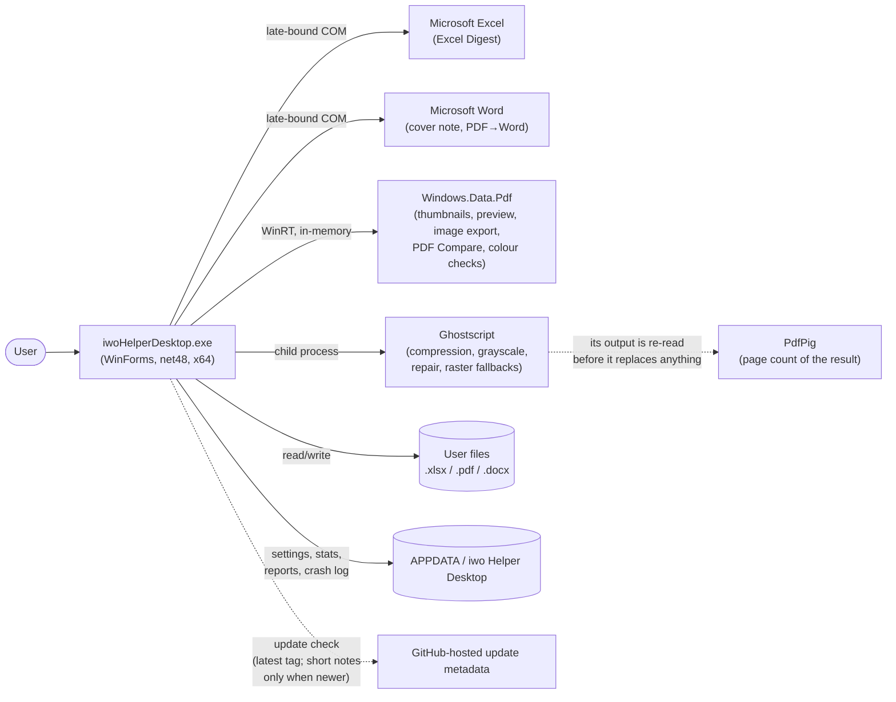
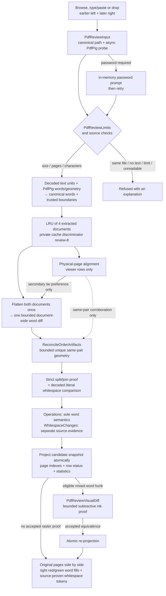
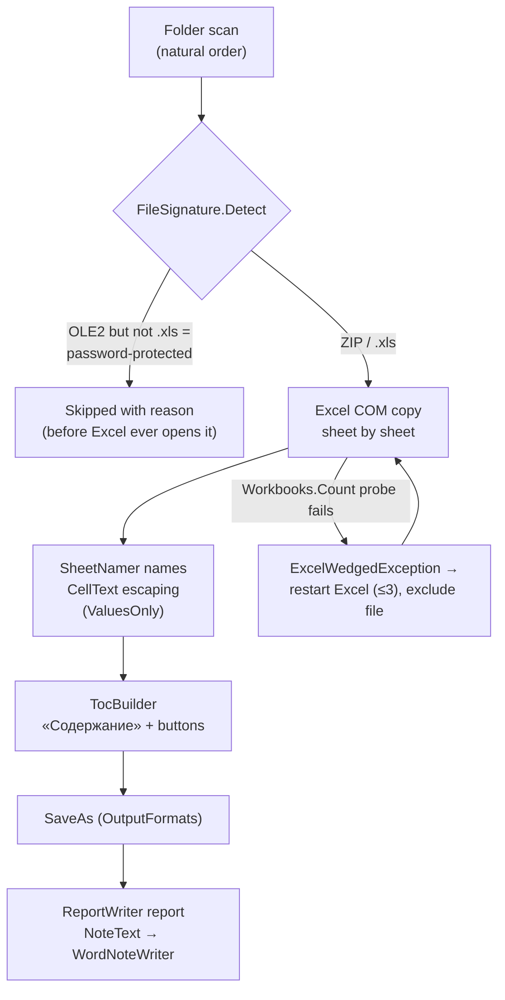
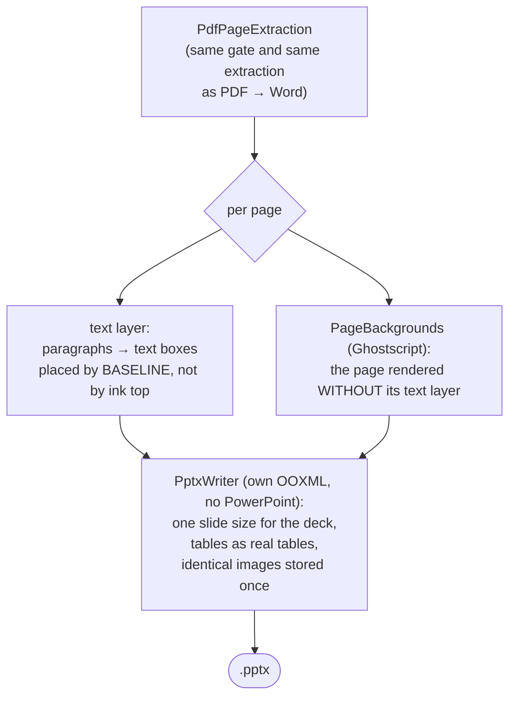
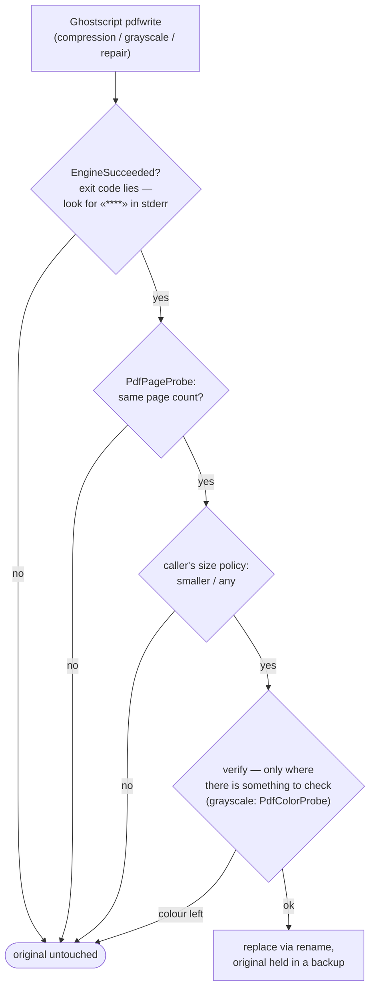

# Architecture

This document is the map of the codebase: what the application is made of, how the pieces
talk to each other, and which rules keep it working. It is written for someone about to
read or change the code. For **what the app does** (features, downloads, usage) see the
[README](../README.md), for the change history see the [CHANGELOG](CHANGELOG.md).

> **Maintenance policy:** this file describes the *shape* of the code — layers, pipelines,
> invariants. Update it when the shape changes (a new tool, a new pipeline stage, a new
> external dependency), not on every release.

## Contents

- [Bird's-eye view](#birds-eye-view)
- [System context](#system-context)
- [Tech stack and constraints](#tech-stack-and-constraints)
- [Code map](#code-map)
- [Architecture invariants](#architecture-invariants)
- [Tool pipelines](#tool-pipelines)
- [Office COM layer](#office-com-layer)
- [Threading model](#threading-model)
- [Error handling and resilience](#error-handling-and-resilience)
- [Persistence and privacy](#persistence-and-privacy)
- [Localization](#localization)
- [Testing](#testing)
- [Build, CI and release](#build-ci-and-release)
- [Repository layout](#repository-layout)
- [Extension points](#extension-points)
- [Key design decisions](#key-design-decisions)

## Bird's-eye view

iwo Helper Desktop is a single Windows Forms executable that hosts **seven independent
offline tools** behind one start screen with two sections (PDF and everything else):

1. **Merge Excel** — merges sheets of every workbook in a folder into one digest (Excel COM).
2. **PDF Merge** — combines pages of several PDFs, copied as-is (PdfSharp).
3. **PDF Split** — extracts pages / splits by ranges, every N, or bookmarks (PdfSharp).
4. **More operations** — a page workshop over one document plus eight actions: save PDF,
   compress, grayscale, repair, pages to images, text to `.txt`, print, document properties.
   The grid is edited like everywhere else (order, rotation, removal, clipboard, undo) and
   **images can be added as pages**, so every action works on the document *as assembled*.
   Each writes a **new** file.
5. **PDF Compare (beta)** — compares two born-digital PDFs in their original page views:
   earlier/left removals use tight red word backgrounds and later/right additions use tight green
   word backgrounds; one document-global semantic diff is refined only by bounded conservative proofs.
6. **PDF → Word** — rebuilds a born-digital PDF into an editable `.docx`
   (PdfPig extraction → own layout analysis → Word COM writing).
7. **PDF → PowerPoint** — turns the pages of a born-digital PDF into a `.pptx` whose text is
   real, editable text (same extraction, own OOXML writer, no PowerPoint required); everything
   that is not text arrives as the page background rendered without its text layer.

Cross-cutting services: optional **PDF compression** (Ghostscript as a child process),
page **thumbnails** (WinRT `Windows.Data.Pdf`), a Word cover note, reports,
usage counters and a history of what was produced and where, an update check (by button and
once at startup), an embedded user guide, and a Russian/English UI.

The guiding principles, in priority order:

- **Offline-first and private.** No telemetry and no document-processing network. The only
  built-in network feature is the update check — by button, and once at startup unless
  switched off. It reads the latest tag and, only when newer, a short change summary. Files
  are written only to user-chosen folders and `%APPDATA%`.
- **Zero footprint.** Target machines have nothing installed: .NET Framework 4.8 ships
  with Windows 10/11 (one-time install on Windows 8.1), Office is driven late-bound (no
  interop assemblies), managed libraries are embedded into the single exe, installs are
  per-user without admin. Both x64 and x86 packages are published.
- **Fidelity first.** PDF pages are copied without recompression, PDF → Word reproduces
  the source layout (columns, tables, spacing, fonts) rather than dumping plain text.
- **Survive real-world input.** Broken, password-protected and hostile files are detected
  up front, a wedged Excel is restarted, results are validated before replacing anything.
- **Logic lives in pure functions** so it can be unit-tested without Office (see
  [Testing](#testing)).

## System context

| Dependency | Kind | Used for | Needed by |
|---|---|---|---|
| Microsoft Excel | COM, late-bound | copying sheets with full formatting | Excel Digest only |
| Microsoft Word | COM, late-bound | writing `.docx` (cover note, PDF → Word) | Excel Digest note, PDF → Word |
| PdfSharp (MIT) | embedded assembly | PDF page copy for merge/split | PDF Merge/Split |
| PdfPig (Apache 2.0) | embedded assemblies | glyph-level text extraction, page count of a produced file | PDF → Word, PDF → PowerPoint, PDF Compare, text export, every Ghostscript run |
| `Windows.Data.Pdf` (WinRT) | OS component (Windows 8.1+) | rendering pages | thumbnails, full-size preview, image export, PDF Compare views/confirmation, colour check after a grayscale run |
| Ghostscript (AGPL) | separate process | image downsampling, colour conversion, rewrite, raster fallbacks | compression (optional), grayscale, repair, PDF → Word raster fallbacks |
| GitHub-hosted update metadata | HTTPS, startup or manual | latest release tag; short localized change summary only when newer | update check only |

Excel and Word are **optional**: PDF Merge, Split, Compare, More operations and PDF → PowerPoint run without any Office.

## Tech stack and constraints

- **C# 7.3 on .NET Framework 4.8, WinForms.** net48 is preinstalled since Windows 10
  1903 and installs once on Windows 8.1 (the installer checks), so target machines need
  nothing else. `LangVersion` is pinned — do not use newer syntax. The minimum OS is
  **Windows 8.1** — the oldest Windows with `Windows.Data.Pdf` (thumbnails).
- **Two explicit architecture builds, no AnyCPU.** The default build is x64
  (`dist\iwoHelperDesktop.exe`), `-p:Arch=x86` / `build.cmd x86` produces the 32-bit exe
  in `dist\x86\` with its own `obj\x86\` (a shared `obj` would let MSBuild's incremental
  clean delete the other arch's output). Office COM and Ghostscript run out-of-process,
  so the tool set does not depend on the app's bitness, a 32-bit process only halves the
  thumbnail document cache (~2 GB address space, each shown PDF is held in memory).
- **One exe.** All managed dependencies (`build/PdfSharp.dll`, `build/pdfpig/*` — 12
  PdfPig assemblies plus net48 polyfills such as `System.Memory`) are embedded as
  resources and resolved by name at runtime by `src/EmbeddedAssemblies.cs`. This also
  removes the need for binding redirects. Services that touch PdfSharp types call
  `EmbeddedAssemblies.Ensure()` first behind `[MethodImpl(NoInlining)]` gates, so the JIT
  never sees a library type before the resolver is registered.
- **Office through `dynamic`** (late binding, `Microsoft.CSharp`): no PIA/interop
  packages, builds on machines without Office, works with any Office version. The price
  is a set of strict usage rules — see [Office COM layer](#office-com-layer).
- **WinRT via `Microsoft.Windows.SDK.Contracts`** — compile-time only, the runtime
  projection is part of .NET Framework.
- Deterministic release build, no PDBs, output flattened to `dist\iwoHelperDesktop.exe`.

## Code map

Everything lives in a single project (`iwoHelperDesktop.csproj`, namespace
`ExcelMerger` — the historical name of the first tool). `src/` is flat, the layers below
are conceptual.

### Application shell

| File | Responsibility |
|---|---|
| `Program.cs` | Entry point. Parses CLI flags, installs `CrashReport`, initializes `Loc`, then runs the GUI (`ShellContext`) — or a headless mode: `--cli` (scripted Excel Digest), `--selftest` (create every window unshown), `--pdfcheck` / `--pdftextcheck` / `--reviewcheck` / `--thumbcheck` / `--gscheck` (embedded-dependency and renderer probes used by CI). A command-looking typo is also handled headlessly and returns bad-usage instead of opening the GUI. Headless modes leave via `FastExit.Now`. The GUI path first claims the single-instance slot (`SingleInstance`); headless modes are checked earlier and always run, however many at a time. |
| `SingleInstance.cs` | One GUI process per user session. A named `Local\` mutex taken **without ownership** (nothing to abandon on a crash, and the name lives only as long as a handle is held) marks the running instance; a second launch broadcasts a `RegisterWindowMessage` signal and exits, so Task Manager shows one app instead of two. The signal is received by a hidden top-level window (`WS_EX_TOOLWINDOW`, never shown) — a message-only window would not do, broadcasts never reach those. The newly started process calls `AllowSetForegroundWindow` before signalling, otherwise Windows lets the running instance restore its window but not raise it. Any failure degrades to “start normally”. |
| `ShellContext.cs` | `ApplicationContext` that owns the hub and all tool windows (independent, non-modal). Reopens the hub, focuses an already-open tool, rebuilds windows on language change (active window last, busy or unsaved-state windows skipped — `IBusyAware.IsBusy` or `IUnsavedStateAware.HasUncommittedState` — and the count of skipped ones reported in a dialog, each rebuilt window put back through `WindowPlacement.Snapshot`/`ShowAt` so a minimized or maximized one returns exactly as it was), exits when the last window closes. Knows which **hub section** each tool was opened from (`HubLevel`) and hands it to the tool as its `Home` action, so “Home” returns to that section and not to the top screen — and carries the section over when the hub is rebuilt on a language change. Owns the `SingleInstance` listener (created before the first window, so a launch that follows immediately still finds it) and answers the signal with `ShowHub`, which is idempotent. |
| `ToolRegistry.cs` | Live-window registry keyed by tool id, prevents duplicate windows. |
| `StartForm.cs` | The hub, two levels deep (`HubLevel`): the main screen offers two sections, inside them live the tool cards (`pdf`, `split`, `ops`, `review`, `ocr`, `pptx` and `excel`) — the PDF section is laid out in three columns, because a third row would not fit a 1366×768 screen while a third column fits easily. The bottom row carries two icon buttons (gear → Settings, circled question mark → About): glyphs are drawn with grayscale antialiasing, since subpixel rendering fringes a small glyph on white, and each keeps a tooltip and an `AccessibleName` — an icon-only button has no other way to say what it does. The levels are **panels of one window**, not separate windows — `ShellContext` keeps a single hub and everything is wired to it. The window size is the same on every level so it never jumps, “Back” and `Esc` return to the top, and the focus is moved to the first card explicitly (otherwise it stays on a hidden control and the keyboard loses its place). PDFs dropped on the section card are held until a tool is picked (`_pending`, cleared on every exit from the section — a stuck set would open the next tool with someone else's files). |
| `IBusyAware.cs` | Marker for windows running a long operation (skipped by the language rebuild). |
| `FastExit.cs` | Hard process exit for headless modes — avoids WinRT finalization crashes on CLR unload. |
| `CrashReport.cs` | Global exception handlers: branded dialog on the UI thread, silent log otherwise, `%APPDATA%\…\crash.log` with size rotation. |
| `UserSettings.cs`, `UsageStats.cs`, `OperationHistory.cs`, `AppDataLock.cs`, `AppStateFile.cs`, `AppPaths.cs` | Optional state under `%APPDATA%`: settings, local operation counters (including Compare) and the bounded recent-result path list. `AppStateFile` owns missing-vs-unreadable reads and atomic line writes; every mutation obtains an exclusive lock file, re-reads, applies only its narrow domain change and publishes only a trustworthy snapshot. This works across processes and Windows sessions. Unknown future lines survive a downgrade, auto-clear is part of the same transaction, and history opt-out removes paths before notifying the hub. Empty `.lock` files contain no state. |
| `SettingsForm.cs` | Whole-program preferences: startup update check; automatic What's New plus its manual reopen action; history switch, age limit and clearing. Laid out from measured control sizes, not literals, and re-read on activation. Update actions share one measured row; the three history actions share another, with captions fitted rather than ellipsized. |
| `HistoryForm.cs` | The list itself, newest first, with “open” and “show in folder”. A window of its own because Settings is already as tall as the smallest supported screen allows, and because a list is not a setting. Existence is checked before opening: the path may have gone stale. |
| `WhatsNewCatalog.cs`, `WhatsNewForm.cs` | Local, version-keyed release notes embedded from `docs/whatsnew.json`. After the hub is shown, the current version opens once as an owned **modeless** window (not a startup-blocking modal), explicitly centred on its owner; closing records the seen version. The first frame always starts at item 1, and expanding support preserves the current reading position while revealing the new panel only downward. An unchecked-by-default suppression option disables future automatic displays, while Settings keeps both an immediate toggle and a permanent “What's new in X.Y.Z” action. Feature cards are concise and non-technical; the independent-development support card and requisites stay collapsed until explicitly requested. |
| `UpdateChecker.cs` | Startup or manual check: reads the latest release tag from the GitHub API and, only when it is newer, fetches a short localized summary from the tracked `docs/whatsnew.json`; it compares versions and asks before opening the Releases page (`Ui.OpenUrlOrShow`, which shows the address when no browser can be started — a swallowed failure would answer “Yes” with nothing at all). It downloads and installs no update. Pure parsing/comparison helpers remain testable without the network. |
| `Loc.cs`, `Flags.cs` | Localization catalog and GDI-drawn menu flags — see [Localization](#localization). |
| `SetupLanguage.cs` | The language picked in the installer. Setup writes a one-line ASCII file next to the settings, the app applies it at startup (it outranks the stored language), saves it the normal UTF-8 way and removes the marker. Setup never edits `settings.txt` itself: it writes text in the system code page while the app reads UTF-8, and a read-modify-write would corrupt non-ASCII paths inside. |
| `UserManual.cs`, `ThirdPartyNotices.cs` | The bilingual user guides and PDFsharp/PdfPig license/NOTICE texts embedded as resources: unpacked beside settings only on explicit About actions. The portable build therefore carries both its offline manual and redistribution notices; `--selftest` verifies all resources in the real exe. |
| `Theme.cs`, `Ui.cs`, `HelpMenu.cs` | Palette, DPI/layout helpers, the shared ☰ menu. Menus are drawn with the **application** font rather than the system menu font: the strip has a fixed height, while the system font size is a separate Windows setting, and that combination clipped the captions. Every window sets its own font too, so that setting cannot reach the layout anywhere else. |
| `JustifiedText.cs` | A paragraph justified to both margins — WinForms offers left, right and centre only, so the alignment is set on the paragraph format through `EM_SETPARAFORMAT`. Shared by About and Settings; re-applied on every handle creation, because WinForms recreates the window and a one-time setup would be lost. |

### UI toolkit (owner-drawn, shared by all tools)

`HeaderBand` (gradient window header — the title block is centred vertically in the band and
child controls are aligned to that block, from measured font heights rather than literals), `ChoiceCard`, `RoundedButton`, `AccentCheckBox`,
`WindowChrome` (title-bar colouring), `WindowFlasher` (completion
flash), `TaskbarProgress` (`ITaskbarList3`), `MessageForm`/`Dialogs` (branded message
boxes), `NumberPromptDialog` (Ctrl+G / “move after page…”, sized to its prompt),
`AboutForm`, `StatsForm`, `FolderPicker`, `CompressionPicker`, `ThumbZoom` (tile sizing,
DPI render width, page-cache capacity). Shared fonts and the app icon are cached per
process by `Ui` (WinForms never disposes `Control.Font`/`Form.Icon`).

`ChoiceCard` measures its own contents and centres the icon-title-description block in the
card, so cards with descriptions of different lengths still look alike, and `RoundedButton`
has three looks (`Primary`, `Secondary`, `OnDark`) with a **filled** disabled state — a panel
where half the buttons wait for an open document must show that without being clicked.

`Ui` also owns the pieces every window would otherwise copy: `InitDialog` (the modal-dialog
frame — title, icon, fixed border, centring, DPI scaling), `RoundedRect` (the one
rounded-rectangle outline behind every owner-drawn control), `Ellipsize` (a variable-length
label that shortens with “…” instead of running off the edge), `OpenPath`/`OpenPathOrWarn`/
`OpenUrlOrShow` (the three ways to hand something to the shell: silently for a result the
user already has, with a dialog for an explicit action, and with the address shown for a
browser that will not start), `SelectAllItems`, and `HeaderLastInTabOrder`. That last one is called from `OnLoad`, not at construction:
`ControlCollection.Add` hands each new control the next free `TabIndex`, so a high index set
on the header while building would put it *first* and land the focus on “Home”.

### Excel Digest

| File | Responsibility |
|---|---|
| `MainForm.cs` | Tool window: folder/output pickers, the one file list (order + per-file results), progress, report/note actions. |
| `MergeService.cs` | The engine (UI-free). Owns the Excel instance and the whole run: pre-filtering, per-file copy, retry of skipped files, self-healing restarts. Defines `MergeOptions`, `MergeResult`, `MergeException` (user-facing, localized), `ExcelWedgedException`. |
| `SourceFileList.cs`, `ListReorder.cs`, `NaturalStringComparer.cs` | File list model, reorder ops, Explorer-style ordering (`StrCmpLogicalW`). |
| `FileSignature.cs` | Container sniffing (ZIP / OLE2 / other) — rejects broken and password-protected files *before* Excel opens them. |
| `SheetNamer.cs`, `CellText.cs`, `OutputFormats.cs` | Legal/unique sheet names (31 chars, `_2` suffixes), cell-entry escaping, `XlFileFormat` mapping. |
| `TocBuilder.cs` | The «Содержание» sheet: hyperlinked table of contents, per-sheet return buttons, frozen header. |
| `ReportWriter.cs` | Plain-text run report, keeps the three latest in `%APPDATA%\…\reports`. |
| `NoteText.cs`, `WordNoteWriter.cs` | Cover-note content (pure) and its rendering through Word COM. |

### Office COM infrastructure

| File | Responsibility |
|---|---|
| `ComSafe.cs` | `Release(object)` / `Collect()` — deterministic RCW release. |
| `ComMessageFilter.cs` | `IOleMessageFilter` that auto-retries `SERVERCALL_RETRYLATER` (busy Excel, AV scans) instead of surfacing `RPC_E_CALL_REJECTED`. |
| `WordCom.cs` | The one place that starts/quits Word and hosts the write-a-docx skeleton shared by `WordNoteWriter` and `WordDocxWriter`. |

### PDF: shared plumbing

| File | Responsibility |
|---|---|
| `EmbeddedAssemblies.cs` | Runtime resolver for the embedded PdfSharp/PdfPig assemblies. |
| `PdfToolFormBase.cs` | Base class of all PDF tool windows: thumbnail grid, zoom slider with an editable “%” box (`ThumbZoom.Percent`/`WidthFromPercent`, two-way-synced with the slider without drift, `Ctrl+0` or a double-click on “%” resets to 100%) and Ctrl+wheel over the slider, compression picker, status/progress strip (with a per-page counter and a selection counter — pure `ProgressItem`/`RestingStatus`, plus the pure `SuccessStatus`/`CompressedPart` pair that assembles every “done” line, so the catalog stores bare fragments while the ✓, the « · » separators and the closing period live in one place), drag-and-drop, a keyboard-shortcuts cheat sheet built from the grid's capabilities (`BuildShortcuts`), the shared grid hotkeys (`ClassifyPageKey`: Ctrl+A/X/C/V/Z/Y/G, Alt+←/→, Delete, Esc, Ctrl+Shift+«+»/«−»), background-work lifecycle. The zoom slider and the percentage share the row with the compression picker on the right, both right-anchored so a constant gap keeps them apart at any width (the slider stretches). Remembers the last zoom width and compression level between runs (`SaveView`, restored in `BuildBottomStrip`). Cooperative cancellation of long operations (`ShouldOfferCancel` ≥ 5 pages): a Cancel button overlays the action button (`CancelToken` → a `volatile` flag the worker polls), withdrawn at the point of no return once the output is committed (`StopOfferingCancel`, wired through to the PDF → Word writer). Background work is marshalled through the shared `Ui.OnUi`/`Ui.RunWorker` (one guarded `BeginInvoke` helper, no per-form copies), `SyncControls` is the abstract per-form hook that reflects the current state (operation, background parse, selection) on the buttons and grid lock, and `FinishOperation` is the shared epilogue: it ends the operation and tells the form whether there is a result worth showing, so cancellation and failure are worded and dialogued in one place. `BeginIndeterminate` switches the bar to a marquee for a phase whose progress cannot be measured (Ghostscript compression runs in its own process and reports nothing) — a full bar with Cancel already withdrawn reads as a hung window. Adding/opening a PDF parses it on a worker (`BeginLoad`/`EndLoad`, `Working` = busy or loading) so a large or network file never freezes the window. Forms open with dropped files via `IFileAcceptor` (drop onto a start-screen `ChoiceCard`, `WireFileDrop` is the shared window drop handler). Each window's size and position persist per form via a single `WindowPlacement.Attach` in `InitShell` (clamped onto a visible screen), which is why closing a busy window — it returns before calling base — saves nothing. |
| `PdfPageOrderFormBase.cs` | Base of every tool whose page grid is **edited**: owns the `PdfPageOrder` model and the whole “order ↔ grid” layer once — reorder by dragging, cut/copy/paste, delete, rotation checkpoints, undo/redo, batch insertion of parsed sources, and the “selected pages, or all of them if none” rule. Split out in 1.18.1, when **More operations** needed page editing too: it works with one document and could not live on the multi-file base, and a copy of the layer would have meant two edits for every future bug. |
| `PdfSingleDocFormBase.cs` | Base of the two tools that work with ONE open document — **PDF Split** and **More operations**. Owns the whole “open a file and show its pages” layer once: the file dialog, the background parse, filling the grid, the status, and accepting files dropped on the window, on the grid or from a start-screen card (`IFileAcceptor`) — what to do with them is the tool's call (`AcceptDroppedPaths`), as is the set of extensions it accepts. `IsPristine` answers the question every action here depends on: is the grid still the file as it is, or must the document be assembled first? |
| `PdfOpsForm.cs` | **More operations**: a page workshop over one document plus eight actions (save PDF, compress, grayscale, repair, pages to images, text to `.txt`, print, document properties), grouped by what they do. The grid is fully editable, and every action applies to the document **as assembled** — untouched pages mean a plain copy of the source, a changed set means the document is rebuilt first (`WriteWorkingCopy` for actions that write a result, `AssembledDoc` for those that read one; `IsPlainSubset` keeps the cheap path where real page numbers must survive in file names). Images are added as pages by wrapping each into a one-page PDF in a per-window temp folder (`ImageToPdfService`), so they flow through the same grid, rotation, printing and compression with no special branch; the folder dies with the window and leftovers from a crashed session are swept on the next add. Every action writes a **new** file — sources are never modified — and the copy-then-transform ones share one method. The window has no single action button, so it tells the base where to draw “Cancel” (`RegisterCancelArea`) instead of handing it a button to replace. Merge and Split reach it through one bridge (`PdfToolFormBase.OpsBridge`, an `Action<string>` the hub supplies): the path is the document to hand over, an empty one just opens or raises the window. The hub is the composition root — the tools do not reference each other. |
| `PdfOrderedToolFormBase.cs` | Base of the tools that assemble one result from pages of several files — **PDF Merge**, **PDF → Word**, **PDF → PowerPoint**. Adds to `PdfPageOrderFormBase` its own layer: choosing files, parsing each in the background and inserting its pages into the set. The concrete forms keep only their buttons, their action worker and a `SyncControls` override. |
| `PdfPageGrid.cs`, `PdfPageOrder.cs` | The thumbnail grid subsystem, OWNER-DRAWN (tiles, number captions, selection, cut-dimming and the rotation badge are painted in `DrawItem`, `LVM_SETICONSPACING` sets the cell, so zoom goes to 400 px past the ImageList limit — an empty metrics ImageList keeps native hit-testing honest and clicks on the outer ring of big tiles are compensated). Lazy visible-only rendering with a larger re-render on deep zoom, an in-window page buffer (cut/copy/paste) with an insertion caret and a hover hint, drag reorder with edge auto-scroll, file drop with an insert position, per-page and whole-document rotation, «Move after page N…», a context menu, `Locked` gating during operations. Owner-draw paint allocates nothing per frame: fill brushes and border pens are process-wide statics, glyph fonts come from the shared `Ui.Font` cache, and the selection tint is cached and rebuilt only on a system-colour change. Ctrl+wheel zoom is coalesced through the slider's throttle (`WheelBasis`) so a fast spin keeps every step. Hovering a tile shows ↺/↻ rotate chips on it. Double-click routing is a pure decision (`ClassifyDoubleClick`, precedence rotate chip → number strip → tile): a hover rotate chip swallows the event so a quick double-click on ↺/↻ turns a full 180°, else the number strip under a tile (`IsOnLabel`) opens «Move after page…», else the tile opens a full-size page preview (`PagePreviewForm`). The page-order model (`PdfPageRef` = source file + page index + rotation) is shared by merge and PDF → Word and keeps undo/redo stacks (Ctrl+Z / Ctrl+Y) of order-plus-rotation snapshots (`BeforeRotate` lets the form checkpoint before the grid mutates angles), the grid mutates only `Rotation` of the shared refs and requests order changes via events. |
| `PdfThumbnailRenderer.cs`, `BudgetedBitmap.cs`, `PdfMemoryBudget.cs`, `RasterBudget.cs`, `LruCache.cs` | WinRT rendering **from memory** (see invariants). Architecture-aware pixel/dimension limits and a process-wide lease gate reserve document copies plus decode/clone peaks before allocation; a `BudgetedBitmap` is the one owner of each raster and its single-release lease. Open documents, page rasters and composed tiles use explicit LRU eviction/retry, with lower x86 ceilings. A late render carries a content generation and is disposed rather than entering a replaced or shutting-down grid/view. |
| `PagePreviewForm.cs` | Modal full-size preview of one page (double-click a tile). Renders on its own background thread with a private `PdfThumbnailRenderer` (single-threaded); the worker returns the page **unrotated** and the UI thread applies the angle, so a render that arrives after the user has turned the page is still correct. A right-click opens rotate right/left (plus the grid's own Ctrl+Shift+«+»/«−» through the shared `ClassifyPageKey`), and the rotation is delegated to a callback the grid passes in — it runs through `RotateItems`, so the undo checkpoint, the tile-cache pruning and the thumbnail repaint all happen exactly as they do in the grid. The shown bitmap is turned in place by the difference between the wanted and the already-applied angle (90° steps are lossless, so no copy and no re-render). A zoom bar (− / % / + / “fit to window” / “Print”) and `Ctrl`+wheel scale the page: the wheel is caught as an `IMessageFilter` because Windows delivers it to the focused control and the scrolling viewport would swallow it, and the zoom is anchored so the point under the cursor stays put (`PreviewZoom.Anchor`). Once the page is bigger than the window it is dragged with the hand cursor (`PreviewZoom.IsDrag` separates a drag from a shaky click). A click does **not** close the window — the surface is now used for panning — `Esc` and the close button do. Size and position persist via `WindowPlacement`; the bitmap is disposed on close, the message filter is removed in `OnFormClosed` (it would otherwise hold the window alive) and a late render is dropped if the window is already gone. |
| `WindowPlacement.cs` | Remembers each window's size and position between runs (keyed by form type name), restored clamped onto a visible working area so a window never opens off-screen or on a disconnected monitor, keeping the maximized state. `Attach` is the only entry point — one line in a window's constructor wires both halves through the `Load` and `FormClosing` events, so a window needs no overrides of its own and the pair cannot be half-removed (restoring and saving are `private`). A window that vetoes its own close leaves its override before calling base, so the event never fires and nothing is saved. Meant for **resizable** windows: a fixed-size one could be handed bounds that no longer suit the current display scale. `NormalBounds` is the single rule for “where does this window sit when it is not minimized or maximized” — a minimized window reports a position far off every screen (-32000, -32000), so anything that copies raw `Bounds` parks the window past the edge of the desktop. `Snapshot`/`ShowAt` package that rule with the window state for `ShellContext`, which reuses it to rebuild windows on a language change instead of keeping its own version. Pure `ClampToWorkingArea`/`Format`/`TryParse` are unit-tested, the wiring is covered by a live test that opens the real windows, and the store lives in `UserSettings` (read-modify-write, so one window never clobbers another's bounds). |
| `Cancellation.cs` | Both halves of cooperative cancellation. `ThrowIf(Func<bool>)` throws `OperationCanceledException` when the flag is set, and services call it between work units. `NoPartialOutput(...)` holds the other half of the promise — **a cancel leaves nothing behind**: a service that writes one file per unit of work (split parts, exported page images) registers each file as it lands, and the wrapper deletes them before the cancel travels on, while a service that writes a single file simply saves at the very end. It is a wrapper rather than a `catch` per site because the same block sat in all three split modes and was missing from the fourth writer, which is how a cancelled image export came to leave half the pages in the folder. An **error** is deliberately not the same case: what was written before a failure stays. |
| `Ghostscript.cs` | Locates gs (bundled → registry → `Program Files` → user profile → `PATH`) and runs it with a validated timeout/cancellation contract. stdout/stderr are always drained; diagnostics are retained only up to 64 KiB while fatal `****` sentinels continue to be scanned across the complete stream. Timeout/cancel kills the process and uses only a bounded post-kill wait. |
| `PdfCompression.cs` | Four levels, PDF 1.4 output, the result replaces the original only if the document survived (see `PdfPageProbe`) **and** the file is strictly smaller. Two levels downsample (`/ebook` 150 dpi, `/screen` 72 dpi) and one — “Very good” — rebuilds the document with `/default` while switching downsampling **off explicitly**, so its promise of untouched resolution does not rest on another program's defaults (the portable build runs on whatever Ghostscript the machine has). `ImageDpi` is the single place that knows what each preset does to images (the values Ghostscript itself sets in `Resource\Init\gs_pdfwr.ps`), `Downsamples` derives from it, and `CompressedSuffix` is the single place that words the result — with a resolution where one was applied, without it where the pictures were left alone. Only raster images are downsampled — text and vectors are never rasterized, which is why the wording is “images to N dpi” and not “compressed at N dpi”. **Level numbers are identifiers, not positions**: they are written to `settings.txt`, so a new level is appended to the end of the enumeration and the display order lives separately (`LevelAt`/`IndexOf`) — inserting mid-enum would have moved everyone who had picked another level. |
| `PrintPreviewForm.cs` | Shows the sheets before they are printed, over the very same `PrintDocument` that is then sent. Not the stock `PrintPreviewDialog`: its print button prints by itself on the UI thread (losing the progress bar, the cancellation and the background work printing already has), and it renders every shown sheet up front and keeps the rasters. Shows the first few sheets and says so — an incomplete preview that stays silent reads as "the job is this short". |
| `PdfCli.cs` | The same operations as the windows, driven from a command line. Parsing is a pure function producing a command description; executing it calls the very service the button calls, so the two cannot drift apart. Exit codes follow the Excel mode (0 done, 1 failed, 2 bad usage), and the rule about sources holds here too — commands that change a file work on a copy, and input equal to output is refused outright. |
| `PdfPasswords.cs`, `PasswordPromptDialog.cs` | Passwords for protected PDFs, entered in this session. A registry rather than a parameter threaded through every method: the password is needed wherever the file is opened — PdfSharp for pages, WinRT for thumbnails, PdfPig for text and composition — and it belongs to the file, not to the operation. **It never reaches the disk**: not settings, not reports, not the crash log. The dialog names the file it is asking about and warns about the consequence of cancelling in the same window, because confirming each refusal separately would double the number of windows on a batch of protected files. |
| `PdfBookmarks.cs` | The table of contents, carried from the sources into the assembled document — read into a flat list with levels, remapped onto the new page order, written back. Flat rather than a tree deliberately: transferring bookmarks is page renumbering, and a tree only gets in the way when a parent drops out. A bookmark whose page did not survive is dropped and its children rise to the freed level, so removing one section cannot take half the contents with it. Used by merge (from its own page map) and by the range writer that serves every split mode. |
| `PdfContentProfile.cs` | What the file is made of — just enough to explain why compression gained nothing. Measures the share of the file taken by images, and answers whether to suggest a level that recomputes them. Computed **only when compression did not help**, so it can afford to read the document. It exists because "the file is already optimized" was a lie for a scan: images were 99.8 % of it, the chosen level leaves images alone by definition, and the same file shrank by 64 % one level down. |
| `PdfPageProbe.cs` | “Is this still a document, and does it hold the same pages?” — the check every Ghostscript run passes before its output replaces anything. Counted with **PdfPig, not PdfSharp**: PdfSharp 1.50 cannot read object streams (PDF 1.5+), which Word and Acrobat write by default, so counting with it would have rejected healthy results on such files. One rule (`PagesKept`) serves compression, grayscale and repair alike, and is deliberately lenient where there is nothing to compare against — repair opens a file that is broken by definition. |
| `PdfColorProbe.cs` | “Did the colour actually go?” — the check of a grayscale run. Looks at what a person sees rather than at the file structure: a sample of pages is rendered through the same WinRT renderer as the thumbnails and searched for saturated pixels, because colour arrives through ICC profiles, palettes and transparency groups and no list of switches covers all of them in advance. The probe can only **disprove**: a page that will not render is not “still coloured”, or the feature would break on the machines where it used to work. |
| `PageRasterizer.cs`, `PageBackgrounds.cs` | Bounded Ghostscript raster fallback and PowerPoint's page-without-text layer. Page geometry lowers DPI before rendering; ranges are chunked and sparse selections never expand solely because their run count is high; process count, pixels, dimensions and temp bytes have ceilings; cancellation terminates the active process. Repeated source-page/rotation backgrounds share one encoded payload, exact solid-colour proof keeps thin graphics, password-opened sources are rendered from a cleaned decrypted working copy, and all retained media has memory leases. |
| `PdfExportService.cs`, `PlainText.cs` | Export out of PDF: pages to PNG/JPEG at an architecture-supported honest dpi through the shared bounded renderer, and the text layer to `.txt`. Each image name is reserved with `CreateNew`, encoded into its own `AtomicOutput`, and published whole; cancellation or an encoder/disk failure cannot leave a partial current page or collide with another exporter. `PlainText` is the pure half — it merges paragraphs **and tables** back into reading order by vertical position, because the analysis moves table words out of the paragraph stream and a naive dump loses them. |
| `PdfReviewForm.cs`, `PdfReviewPageView.cs`, `PdfReviewViewContent.cs`, `PdfReviewUnifiedRenderer.cs`, `PdfReviewFullScreenForm.cs` | The beta Compare presentation layer. One semantic result feeds two switchable views without recomputation: the default unified redline uses the later/right raster as its base, keeps additions green, composites only per-word deleted fragments from the earlier raster in red with strike/rail ownership, and carries both added and removed literal-whitespace markers on the same canvas; Side by side preserves both original pages and independent physical-page navigation beneath one compact colour legend per pane. A missing overlay raster falls back to red deletion geometry rather than hiding the edit. The alignment list and the two source panes use visible movable splitters; service rows are capped so the PDF remains usable at default and minimum window sizes. Every canvas stores one immutable render request, so double-click opens a maximized form that reruns the exact same base/overlay/highlight content at a larger bounded width; the fullscreen view cannot recursively open another. Page identity, result revision and `BudgetedBitmap` ownership reject stale work and release both base and overlay on every failure/close path. |
| `PdfReviewPageSurface.cs` | Read-only selectable page surface over the published raster. It maps only trusted word boxes for selection/copy, but gives each box a small bounded interaction halo and permits a drag to continue across nearby white gaps, so ordinary text selection does not require pixel-perfect glyph hits. It supports forward/reverse drag, Shift extension, Ctrl+A, Ctrl+C, Escape and a local Copy / Select all menu, and keeps capture, bounded edge autoscroll, focus and selection cleanup page-local. Geometry is interaction-only and never creates text or whitespace. |
| `PdfReviewTextSelection.cs` | Immutable trusted selection/copy model and clipboard boundary. It admits only final published words whose source span and text are trusted, reconstructs exact separators only from decoded `WhitespaceBoundaries`, inserts one explicitly flagged readability space when no boundary is proven, and publishes persistent Unicode text through a bounded injectable clipboard writer. The fallback is not semantic whitespace evidence. |
| `PdfReviewHighlightRenderer.cs` | Pure Review-only 32-bit compositor. In normal mode it fills only authoritative deletion/insertion word boxes with `#EC0808` / `#1BE91A`, preserves dark glyphs, chromatic ink and alpha, recomposes neutral antialias pixels deterministically, and never joins spaces or geometry gaps. High Contrast deliberately retains the system-colour outline/pattern and `−` / `+` ownership grammar instead of custom fills. |
| `PdfReviewInput.cs` | The testable boundary from browse, typed/pasted text or file drop to Compare. `Resolve` trims outer quotes, canonicalizes and checks `.pdf`/existence; `Probe` checks readability asynchronously while preserving password-required as a valid selection. `PlanDrop` is the pure routing policy: two files assign left/right in order; an explicit side wins for one file; neutral space fills the first empty side and never silently replaces one when both are full. |
| `PdfReviewService.cs`, `PdfReviewModel.cs` | Compare orchestration and authoritative state: guardrails before heavy work (`PdfReviewLimits` — per-file size, pages, characters, render pixels, exact-diff cells and total semantic work), PdfPig extraction, canonical visible words, decoded source provenance, then semantic diff and visual refinement. A successful extraction lives in an in-memory LRU of four documents under the private `review-8` semantic cache discriminator. Every `PdfReviewWordOp` explicitly owns its actual `LeftWords` and `RightWords` plus match provenance; `PdfReviewResult.Operations` is the sole word-semantic authority, while literal `WhitespaceChanges` are a separate first-class stream. `PublishState` validates a complete projection before atomically swapping all exposed snapshot references. |
| `PdfReviewDiff.cs` | Pure document-global semantic engine. It aligns physical pages for viewer presentation/corroboration, flattens each document once, runs one bounded NFC word diff, reconciles only uniquely proven same-pair extraction-order artifacts, applies strict split/join proof, compares trusted decoded whitespace, and centrally projects both streams into owner-page indexes, row status and statistics. A manual pair or physical page never starts a page-local diff; ambiguity or exhausted proof work preserves conservative Delete/Insert candidates. |
| `PdfReviewVisualDiff.cs` | Strictly subtractive, word-only confirmation of existing mixed `Delete`/`Insert` candidates. Only explicitly paired pages are rendered, at bounded size; related candidates are judged atomically by local visible ink with small bounded registration. It cannot create a match, touch whitespace, or make `RasterEquivalent` a trusted whitespace anchor. Missing/coarse/failed rendering, cap exhaustion or cancellation leaves semantic candidates and the prior valid snapshot intact; the production renderer and every returned bitmap have explicit disposal ownership. |
| `AtomicOutput.cs`, `StartupSweep.cs` | One-result publication. The caller writes to a unique neighbour; NTFS uses `File.Replace`, while unsupported filesystems use two same-directory renames with a full-name backup. An empty `.txn` marker encodes target/temp/backup names in its own filename and stays open with an incompatible sharing handle. On rollback failure the sole backup and marker remain; startup/next safe sweep asks the same `AtomicOutput` protocol helper to restore a missing target before deleting anything. Cleanup runs after the shell appears so an offline history path cannot block launch. |
| `IUnsavedStateAware.cs` | Marker for windows holding uncommitted work (a typed page list, loaded files, a comparison in progress); the hub's language rebuild skips such windows and reports how many stayed on the previous language. |
| `PdfSplitPlan.cs` | The pure split model without PDFsharp: `ClonePages` takes the edited working order off the grid, and parts carry pages from that order while labels and bookmark titles keep their original semantics — so Split follows the user's edits without the source ever being the thing that is reordered. |
| `PdfConvert.cs`, `GsRewrite.cs` | Grayscale and repair through Ghostscript. `GsRewrite` is the pipeline both they and compression share, and it runs four checks in a deliberate order — cheapest first, each only for what passed the previous: the engine really worked (`EngineSucceeded` — its exit code lies on a file it cannot read), the document kept its pages (`PdfPageProbe`), the caller's size policy (`replace`), and an optional check of the output itself (`verify` — grayscale looks with `PdfColorProbe` whether the colour is gone). The original is restored on any failure. Compression replaces only a **smaller** file, the conversions replace any sound one. Grayscale passes `-sColorConversionStrategy=Gray` **alone**: pairing it with `ProcessColorModel` is what the pdfwrite documentation asks not to do (since 9.11 the strategy sets the model itself) and is the subject of bug 693074. |
| `PageInterleave.cs` | Pure interleaving of the page order — assembling the two stacks a single-sided scanner produces (fronts, and backs in reverse). |
| `NameTemplate.cs`, `OutputFile.cs` | Output names: pure token substitution (`[BASENAME]`, `[FILENUMBER###10]`, …), path identity, and `UniqueOutput` for new multi-file results. It writes once to a unique neighbour, then claims `name`, `name_2`, … with a non-overwriting rename; concurrent split/export jobs cannot check-then-overwrite each other and no empty placeholder needs a backup transaction. |
| `PreviewZoom.cs` | Pure zoom/pan maths shared by the full-size preview and PDF Compare panes: the step ladder, fit-to-window scale, cursor-preserving scroll anchor, centred offsets and drag threshold. |
| `BlankPages.cs` | Blank sheets: which positions need one when padding to even for duplex (pure), and writing a one-page sheet that enters the grid the way an image does — a wrapper file in the window's temporary folder, an ordinary page from there on. The sheet takes the format of its neighbour: a different size mid-document reads as a mistake. |
| `PdfDrop.cs`, `PageRanges.cs`, `PageRangePresets.cs`, `PdfProbe.cs` | Drag-and-drop extraction (PDF everywhere, PDF **and images** in More operations), `1,3-5`-style range parsing, the generators behind the Split dropdown's ready-made ranges (all / odd / even / every N, plus the label shortening for a long list), a tiny generated PDF for self-checks. A generator returning an empty string means "no such pages in this document", and the form then does not offer that choice at all — every offered range has to parse. |
| `ImageToPdfService.cs` | A picture becomes pages: every frame (a multi-page TIFF has several) lands on an A4 sheet with 1 cm margins, fitted whole and centred, the sheet taking the orientation of the image. Holds the format traps in one place — EXIF orientation, transparency flattened onto white, input read through memory, and a JPEG carried through unchanged. Architecture-aware per-frame dimensions, source/decode/encode leases and retained-stream aggregate admission reject unsafe work before GDI allocation; cancellation is polled between TIFF frames; output is atomic and write failures are reported as output failures rather than blaming the source image. |

### PDF Merge and Split

`PdfMergeForm` / `PdfMergeService` (load page sizes, copy pages as-is in shown order),
`PdfSplitForm` / `PdfSplitService` (extract selection, split by ranges / every N /
top-level bookmarks). Both compress optionally and never modify the source. Both are
cancellable during page assembly (the page count drives the ≥ 5 threshold), the optional
Ghostscript compression that follows runs past the point of no return and is not interrupted.
Split edits a **working copy** of the page order (`PdfSplitPlan.ClonePages`): the grid
allows reordering, every split mode follows the edited order, and part names/bookmarks keep
their original semantics. Every writer goes through `AtomicOutput` — a result lands as a
unique temporary file and is committed whole, so a crash, an error or a cancel never leaves
a half-written file and never replaces the previous one mid-write.

**PdfOpsForm design rationale (858 lines):**  
More operations form hosts 11 buttons for 7-8 distinct operations. Size is justified by:
- Grid management (drag, selection, rotation, zoom) inherited from base
- 7 operation handlers with async workers, progress, error handling
- Image-to-PDF conversion (`ImageToPdfService` wrapper per window)
- Menu for DPI selection (4 choices)

**Why no Command Pattern / Strategy / abstraction?**  
Alternative architecture (interface per operation, factory, registry) would split 858 lines into 15+ files with boilerplate. Trade-offs:
- **Current (single file):** Easy to understand, all logic visible, grep-friendly. New operation = 1 method + 1 button.
- **Abstracted (15 files):** Testable in isolation, extensible via plugins. Overkill for 7 operations that change once per year.

Verdict: YAGNI. Operations are stable, plugin system not needed. Current design chosen deliberately for simplicity.

### PDF Compare (Review)

The feature is deliberately **beta and born-digital-only**: it compares the text layer of two
PDFs without converting either document and performs no OCR. The earlier version belongs on the
left and the later one on the right. An image-only/scanned document is rejected rather than
returning an empty result. A protected PDF is still a valid source: the normal password dialog
appears when comparison needs to open it, and the password remains in memory only.

`PdfReviewInput` owns the source lifecycle. Browse, typed/pasted text and drop all reach the same
canonical-path and readability checks; editing a field immediately invalidates the old resolved
source and result, while the PdfPig probe runs asynchronously under a generation number. Drop is
wired recursively over the real child-control tree, and its pure policy contains no hidden guess:
two files assign left/right in supplied order; one over an explicit side replaces that side; one
on neutral space fills the first empty side; neutral space with both sides full asks for an
explicit side; more than two files are refused.

Comparison has six load-bearing stages:

1. **Canonical words and source provenance.** Before PdfPig word extraction discards separators,
   `PdfTextExtract` retains decoded `page.Letters` as source units and maps a retained word back
   only through one unique adjacent source span. Filtering, incompatible orientation, overlay
   duplication or non-unique/reordered mapping makes that span untrusted. `PdfReviewService.BuildWords`
   still uses `OcrLayout` geometry to form canonical visible words and NFC-normalized keys, but
   geometry may only group visible fragments or reject implausible evidence: it never proves a
   space, NBSP, tab or line break. Literal whitespace semantics can come only from trusted decoded
   units, including a positively recorded empty source boundary. A visual wrap or physical page
   edge never synthesizes CR/LF evidence.
2. **One global word diff.** `PdfReviewDiff.Align` builds one-to-one physical viewer rows. Separately,
   each word receives its physical owner, both documents are flattened once in physical order, and
   one diff runs over the two complete sequences. The exact LCS is capped by the absolute
   1,000,000-cell ceiling and the caller's possibly stricter `MaxDiffCells`; larger middles use a
   deterministic linear-space Myers bisect. A finite 20,000,000-unit semantic work budget bounds
   all optional proof. Repeated-content ties may prefer owner pages already sharing a viewer row,
   but that preference cannot shorten the global LCS. Work exhaustion leaves unverified text as
   conservative Delete/Insert rather than declaring it equal.
3. **Bounded extraction-order reconciliation.** `ReconcileOrderArtifacts` inspects only small mixed
   Delete/Insert regions isolated by stable exact counterparts. A candidate must belong to one
   explicit left/right physical-page pair, carry finite local geometry, and have exactly the same
   NFC key multiset including duplicate multiplicity. After bounded local registration, same-key
   geometry must admit one unique perfect matching; ambiguity, unrelated exact counterparts, real
   movement, cross-page ownership, oversized regions or missing evidence abstains. Accepted words
   become explicit `ReconciledOrder` counterparts while every unmatched real edit remains. This is
   a post-diff proof, not a second page-local semantic comparison, and reversing inputs chooses the
   same physical matches with ownership swapped.
4. **Strict split/join and literal whitespace.** A `1↔2` or `2↔1` word hunk becomes `SplitJoin`
   only when exact concatenation, two stable exact anchors, explicit page ownership, compatible
   flow/geometry, Unicode-safe boundaries, a decoded separator on the split side and a trusted
   empty source boundary at the same offset on the joined side all agree. Otherwise it stays
   Delete/Insert. `CompareWhitespace` then compares only boundaries attached to unambiguous
   `Exact` counterparts. U+0020 multiplicity, NBSP, tabs, logical line breaks (CRLF/CR normalized
   to the same logical atom) and other Unicode whitespace remain distinct. Geometry may veto a
   candidate or place its marker after proof, but visual gaps, reconstructed rows, wrapping,
   physical page boundaries and raster pixels cannot create a character.
5. **One projection and atomic snapshots.** `PdfReviewWordOp` retains actual `LeftWords`,
   `RightWords`, explicit counterpart matches and `PdfReviewMatchKind`; Delete always owns the
   earlier/left side and Insert the later/right side. `PdfReviewResult.Operations` is the sole
   word-semantic authority, with `WhitespaceChanges` as the separate literal-whitespace authority.
   The central `Project` builds word and whitespace owner-page indexes, alignment-row status and
   statistics. Word counts, replacements and changed percentage remain word-only; whitespace has
   separate change/deleted-atom/inserted-atom counts and can make a page changed. `PublishState`
   validates every reference before swapping the whole snapshot, so cancellation or failed proof
   cannot expose a half-rebuilt result. Manual physical-page selection only re-projects the existing
   streams and never re-diffs a page.
6. **Word-only visual refinement.** `PdfReviewVisualDiff` is strictly subtractive: it can inspect
   only pre-existing mixed word Delete/Insert candidates on one explicit physical-page pair, and
   can replace them only with `RasterEquivalent` counterparts after bounded local ink equivalence.
   It cannot create a candidate, alter whitespace, or make a raster match a trusted whitespace
   anchor. Limits of 512 candidate words per hunk, 1,000,000 relation checks, 8,000,000 sampled
   pixels per hunk and 32,000,000 per result bound the work. Renderer unavailability/failure,
   insufficient resolution, ambiguous ownership, no ink, cap exhaustion or cancellation retains
   the text-semantic candidate. The production `PdfThumbnailRenderer` is disposable and owns a
   bounded document LRU; the refinement layer disposes every returned bitmap. A refined snapshot
   publishes only if the semantic source references are still current and the complete replacement
   projection is ready.

The result view keeps the original pages side by side, with an alignment-row list,
previous/next-change navigation and optional manual pairing. In normal mode, only authoritative
earlier/left deletion word boxes receive the exact red fill `#EC0808`, and only authoritative
later/right insertion word boxes receive the exact green fill `#1BE91A`. The compositor preserves
dark original glyph pixels, chromatic source ink and alpha, and recomposes neutral antialias pixels
over the semantic colour. It never broadens a box or bridges spaces, unchanged text, overlapping
scanline gaps or inferred regions. Whitespace uses separate `␠`, `NBSP`, `⇥` and `↵` markers,
never word fills. Persistent localized `−`/`+` side rails are clickable: each rail selects the
corresponding trusted changed fragment, while the legends keep ownership explicit. In Windows
High Contrast, system colours and solid/dashed outline/pattern treatment replace the custom fills
while the `−`/`+` grammar remains, so colour is never the only carrier of meaning.

Each ready pane also publishes a trusted, read-only selectable word layer with the matching bitmap.
Mouse drag, Shift extension, Ctrl+A for the current page, Ctrl+C, Escape and the local Copy / Select
all menu operate independently per pane. Copied words come only from final `PdfReviewPage.Words`
with valid source spans. Exact separators come only from decoded source `RawText`; when no trusted
boundary exists, `BuildCopyText` inserts one U+0020 readability fallback and reports it to the user.
That fallback is never stored as whitespace evidence. OCR, raster pixels, geometry, visible gaps,
wrapping and page boundaries cannot create copied content.

`PdfReviewPageView` hides the white page canvas until a bitmap is ready and exposes explicit
empty/drop/loading/ready/missing/unavailable states. A single form-owned message filter routes a
normal wheel to the pane under the pointer: it scrolls locally first, then at the top/bottom edge
selects the nearest row containing a page on that side, skips gaps and does not wrap. Downward
continuation opens at the top, upward continuation at the bottom. Ctrl+wheel changes only that
pane's zoom around the pointer and never changes the selected row. Late renders are checked against
both render generation and result content revision. Every transition out of ready detaches trusted
text, releases capture, stops autoscroll, clears selection and disposes the old bitmap before any new
raster/layer pair can publish. The message filter, renderer, timers and pane-owned bitmaps are
disposed on close.

Default source guardrails are 200 MB per file, 500 pages, 2 M extracted characters and 25 M render
pixels, in addition to the semantic and visual budgets above. Four successful extractions are
cached in memory by canonical path, file stamp and the private **`review-8`** semantic discriminator;
that discriminator invalidates old cached meaning and is not a public product version. The public
release remains **1.18.5**.

Production-route tests generate independent born-digital PDFs and compare both directions through
`PdfReviewService.Compare`: document-wide re-pagination, repeated anchors, two-dimensional
form/table extraction order, real insertions/deletions/replacements, strict split/join and literal
whitespace, representation variants, cancellation, work exhaustion, snapshot atomicity, bitmap
ownership and viewer behavior. An optional local regression hashes and compares the untouched root
`1.pdf`/`2.pdf` fixtures in both directions and rejects broad false form highlights. Acceptance also renders the real normal-mode word fills and High Contrast grammar, exercises trusted selection/copy/paste through the compiled controls, and inspects the screenshots; aggregate counts alone are not sufficient.

The design is checked against these external practices rather than relying on PDF extraction order
or invisible cleanup assumptions:

- [Myers' shortest-edit-script algorithm](https://doi.org/10.1007/BF01840446) underpins the
  bounded linear-space fallback; semantic cleanup remains conservative and post-diff, consistent
  with [diff-match-patch cleanup semantics](https://github.com/google/diff-match-patch/wiki/API).
- [PdfPig layout analysis](https://github.com/UglyToad/PdfPig/wiki/Document-Layout-Analysis) and
  the [PDFBox text-extraction FAQ](https://pdfbox.apache.org/3.0/faq.html) both warn that content
  order, reading order, reconstructed words and inferred spaces are layout-sensitive. The
  [PDF Association tagged-PDF guide](https://pdfa.org/download-area/publications/Tagged-PDF-Best-Practice-Guide.pdf)
  likewise distinguishes logical structure from content-stream order. Therefore geometry can
  corroborate order, but cannot manufacture literal whitespace or silently erase ambiguity.
- [jsdiff](https://github.com/kpdecker/jsdiff) exposes whitespace-preserving word tokenization and
  [Git diff](https://git-scm.com/docs/git-diff) treats whitespace ignoring as an explicit policy;
  Review therefore stores exact decoded whitespace separately instead of normalizing it away.
- [WCAG 2.2 Use of Color](https://www.w3.org/WAI/WCAG22/Understanding/use-of-color),
  [Non-text Contrast](https://www.w3.org/WAI/WCAG22/Understanding/non-text-contrast),
  [G111](https://www.w3.org/WAI/WCAG22/Techniques/general/G111.html),
  [G182](https://www.w3.org/WAI/WCAG22/Techniques/general/G182.html), and Microsoft's
  [WinForms accessibility](https://learn.microsoft.com/en-us/dotnet/desktop/winforms/advanced/walkthrough-creating-an-accessible-windows-based-application)
  and [high-contrast](https://learn.microsoft.com/en-us/windows/apps/design/accessibility/high-contrast-themes)
  guidance are why symbols, line patterns, localized legends and system high-contrast colours
  carry the same meaning as the custom palette.

### PDF → Word pipeline

| File | Responsibility |
|---|---|
| `OcrForm.cs` | Tool window: multi-file thumbnail grid, cross-file page ordering, convert action. |
| `PdfToWordService.cs` | Orchestrator: scan gate (`AnyPageHasText`), per-source extraction cache, page assembly in shown order, progress split extraction/writing. The single point where a scanned-PDF (OCR) branch would plug in later. |
| `PdfTextExtract.cs` | PdfPig-based extraction to `PdfPageText`: words with geometry/font/colour, ruling lines, images, hyperlinks, page margins, plus decoded source units and unique source spans retained for Review before `GetWords()` discards separators. Ambiguous spans stay explicitly untrusted, so the general layout pipeline never has to pretend reconstructed gaps are literal characters. Filters: rotated text, private-use glyphs, invisible ink (kept on real backdrops), doubled glyphs → real bold, text under low overlay images. Detects a text-drawn stamp and carries it as a rendered crop. A user page rotation from the grid is applied HERE, before any layout analysis: the orientation filter keeps the text that becomes horizontal, `PageRotation` transforms words/ruling/images (bounds and pixels) and swaps the page dimensions, raster crops are inverse-mapped into the source space. |
| `PageRotation.cs` | Pure page-space rotation math (points, boxes, PNG pixels, H↔V ruling, dimension swap) shared by the extraction pipeline and the grid tiles. |
| `OcrLayout.cs` | Layout analysis: words → lines → blocks → paragraphs (`OcrParagraph`/`OcrRun`). Every word carries the start of its **baseline** alongside its ink box, and a line takes the median of its words' — a superscript sits on its own baseline and would pull an average off. The coordinate-driven writers place text and measure line spacing by it. Paragraph boundaries (gaps, indents, short lines, list markers, deliberate hard breaks), alignment classification (left/justify/centre), per-paragraph first-line indents, super/subscript and footnote marks, Cyrillic-aware hyphenation rules. Where the file carries **document structure** (`StructureBlocks.cs`), those boundaries are corrected by it: two lines the author put in one block are never split. The correction only ever **removes** a break, never adds one — a producer that marks every line separately then changes nothing instead of fragmenting further — and geometry keeps a veto for lines that turn out to be far apart. |
| `XyCut.cs` | Recursive X-Y cut: whitespace bands split a page into floors and columns, `OrderTree` keeps side-by-side siblings marked for band layout. |
| `TableDetector.cs` | Ruled tables: connected ruling components on a spatial grid, ≥2×2 cell lattice, colspan/rowspan from missing borders, per-cell text. Also turns lone rules into `____` placeholders and feeds `UnderlineDetector`. |
| `GridDetector.cs` | Unruled label/value grids (receipt-style forms) → borderless tables with kept row spacing. |
| `StampDetector.cs`, `ListMarker.cs`, `UnderlineDetector.cs`, `GlyphDedup.cs`, `FontNames.cs`, `MathUtil.cs`, `OcrTable.cs`, `PdfLine.cs` | Focused helpers: stamp region, list-marker recognition, underline mapping, glyph dedup, font-name normalization, medians, table/line models. |
| `ListNesting.cs` | Nesting level of a list item from its left edge, as a **stack of open indents** — the same trick used to parse indentation-based syntax. A level is therefore the *depth* of an indent, not the ordinal of a newly seen edge: an item indented between two known levels returns to the matching one instead of claiming to be deeper than all of them, and returning to an outer indent closes the inner levels by itself (so a second list does not inherit the depth of the first, and no separate reset is needed). A step under `MinNestStepPt` (12 pt, against Word's 18 pt list step) counts as the same level, which is what keeps a flat list with a ragged left edge from being emitted as spurious nesting. One instance per layout region; `WordDocxWriter.WordListLevel` maps 0-based depth onto Word's 1-based levels with the clamp. |
| `WordDocxWriter.cs` | Writes the `.docx` through Word COM: a section per PDF page (size, orientation, margins), zeroed Normal style, `OrderTree`-driven side-by-side bands and `CoalesceRowBands` as borderless tables, native Word lists (start value set on the document's own list template), fonts normalized with an installed-font fallback to Times New Roman (keeps Cyrillic off the East-Asian justification path), source vertical rhythm with a `FitSpacingToPages` pagination guard. |

### PDF → PowerPoint pipeline

Everything up to `PdfPageText` is the pipeline above — the parse layer knows nothing about
the output format. The `.pptx` differs only in what happens after it.

| File | Responsibility |
|---|---|
| `PptxForm.cs` | Tool window — a 40-line specification on top of `PdfConvertFormBase`. |
| `PdfConvertFormBase.cs` | The window shared by both converters (grid, ordering, printing, progress with cancel, error wording, history and counters). What differs between the tools lives in `ConvertToolSpec`: catalog prefix, colour, extension, STA requirement, the convert delegate. The body is laid out from the **measured** height of the beta note (`LayoutBody`, `NoteHeight`, `ContentTop`): a fixed height cut the warning off on a narrow window or a large system font. |
| `PdfPageExtraction.cs` | The first half of any “PDF → document” conversion, shared with the Word path: unique sources, scan gate, rotations, per-source extraction, assembly in shown order. |
| `PdfToPptxService.cs` | Orchestrator: parse (in `PageLayoutMode.Slide`) → page backgrounds → write, progress split three ways, result written to a temp file and moved last so a cancel leaves nothing behind. No COM, so no STA thread. |
| `PageLayoutMode.cs` | What the parser does differently for a flow output and for an absolutely-positioned one. For a slide: **every source line becomes its own paragraph** (a slide cannot re-flow text — another engine breaks lines by its own metrics, while underlines and rules arrive in the background and stay where they were, so they would start crossing the letters); a single-line row is further split at wide gaps (a row of chart labels must not collapse into one box); lone ruling lines do **not** become `____` placeholders (a flow writer has no other way to draw a line, a slide gets the real one); a text-drawn stamp is **not** flattened into an image (its text must stay text). |
| `PageBackgrounds.cs` | Page rendered **without its text** (`-dFILTERTEXT`, one Ghostscript run per source file): DPI by page count, blank pages dropped, user rotation applied, media budget. Missing Ghostscript degrades silently to a text-only deck. |
| `UserManual.cs` | The user manual, embedded as a resource in **both languages** and unpacked beside the settings on first use — so it is there for the portable build and without a network. Which one opens follows the language of the interface. That both are actually inside the exe is checked by `--selftest`, not by the unit tests: those have a build of their own, without the application's resources. |
| `DiskSpace.cs` | Recognises “the disk is full” by its error code and names the drive and what is left on it. The system's own message says neither, and the result and the temporary files live on different drives. |
| `StructureBlocks.cs` | Which logical block (paragraph, list item, cell) each letter belongs to, read from the marked content of a **tagged PDF** (ISO 32000 §14.7 — Word, PowerPoint and Acrobat all write it). Only the block number is taken: it answers “are these two lines one paragraph”, which is the whole question. The roles live in the structure tree and are not needed for that. The `Artifact` flag is deliberately **not** used to drop text — on real files it turns out to be set on visible text, and trusting it would erase content. |
| `PptxWriter.cs` | Model → slides: paragraph → text box (zero insets, autofit off, no wrap, box placed against the **baseline** of the first line so the letters land where they were — the factor is measured against real PowerPoint, and the baseline is used rather than the top of the ink because that top depends on whether the line has capitals at all; the first line is given no exact spacing of its own, because an exact spacing describes the distance *between* lines and not the place of the first one), run → `a:r` (size, weight, colour, font, super/sub, hyperlink), table → `a:tbl` with merge flags, background → slide background (or a locked picture when the page had to be scaled to fit). Every line of a paragraph carries **its own indent** from the box edge and the paragraph is set flush left: the box is one per paragraph and its width is known only to within the slack allowed for another engine's metrics, so centring a line inside it would place it by that inexact width. The indent places it exactly. Embedded images are placed **only when the page has no background**: the background is the page without its text, so it already contains them — drawing them twice would double the file and make “delete the picture” a lie. |
| `PptxGeometry.cs` | Units and axes: points → EMU, Y flipped from page height, slide size by the most common page size, `SlideFit` scaling and centring for pages that differ from it. |
| `PptxParts.cs`, `OoxmlPackage.cs`, `XmlText.cs` | The format itself: constant parts (theme, master, blank layout), relationship files, and the OPC packaging rules — content types first in the archive, part names without a leading slash inside it and with one in `[Content_Types].xml`, UTF-8 without BOM. `XmlText` strips what XML cannot carry (control characters, unpaired surrogates) before escaping. |
| `RasterUtil.cs` | Shared raster checks: “is this image blank” and “PNG or JPEG, whichever is smaller” (transparency detected by content, not by pixel format — otherwise nothing is ever recompressed). |

> Naming note: the `Ocr*` files predate the feature's final shape — the tool handles
> **born-digital** PDFs, no OCR happens today. The orchestrator comment marks where a
> real OCR branch would attach.

## Architecture invariants

- **Services are UI-free and forms are logic-free.** Forms gather input, start a worker,
  render progress/results. Everything decidable is a pure static function under unit
  tests, everything with side effects lives in a `*Service`/writer class.
- **All Office COM sits behind `MergeService` / `WordCom`** with `ComSafe` +
  `ComMessageFilter`. Forms never touch COM objects.
- **COM calls run on dedicated STA worker threads**, never on the UI thread and never on
  thread-pool (MTA) threads.
- **WinRT PDF documents are always loaded from memory** (`InMemoryRandomAccessStream`),
  never from a file path: `LoadFromFileAsync` keeps the file memory-mapped, which would
  make a shown file impossible to overwrite (`ERROR_USER_MAPPED_FILE`).
- **Sources are never modified.** Every tool writes new files, compression replaces its
  own output only after validation. Page rotation is a property of the page **in the
  model** (`PdfPageRef.Rotation`) — it is composed with the page's own `/Rotate` when
  the output is written, never applied to the source.
- **Nothing an external engine produced is trusted on its word.** Ghostscript reports
  success on a file it could not read and on a conversion it only half performed, so its
  output is re-opened and counted before it replaces anything, and a run that promises
  something checkable (grayscale) is checked (`PdfPageProbe`, `PdfColorProbe`). Such a
  check may only ever **disprove**: when it cannot look — no renderer, an unreadable
  original — the answer is "nothing to say", never "it failed", or the feature would
  break on the machines where it used to work.
- **Thumbnail memory is bounded.** Rendered pages live in a byte-budgeted LRU (halved
  in a 32-bit process), tile keys include the rotation, so duplicated pages can carry
  different rotations. An evicted page silently re-renders when scrolled into view.
- **User-visible strings go through `Loc.T`** (both languages), *generated documents*
  (cover note, TOC sheet, reports) are deliberately Russian regardless of UI language.
- **No new runtime dependencies** unless embedded as a resource and MIT-compatible,
  AGPL code (Ghostscript) is only ever invoked as a separate process.

## Tool pipelines

### Excel Digest

Resilience is the point of this pipeline: signature pre-filtering keeps poisonous files
away from the shared Excel instance, `ComMessageFilter` absorbs busy-server rejections,
a responsiveness probe between files catches a wedged Excel, which is then restarted
with the offending file excluded, skipped files can be retried later without a full
rebuild (`RetrySkipped` merges old and new results). All failure reasons flow as one
wording into the list UI, the report and the cover note.

### PDF Merge and Split

PdfSharp opens sources read-only and copies page objects as-is — nothing on the page is
re-encoded. The thumbnail grid renders through WinRT in a background
thread with an LRU document cache, merge writes pages in the exact shown order (across
files), split writes selections/ranges/every-N/bookmark chapters. User-assigned page
rotation travels with the page: merge reads it from each `PdfPageRef`, split takes a
rotation map keyed by source page index (one convention for all four modes), and both
compose it with the page's own `/Rotate` in the output. Optional Ghostscript
compression runs per output file with validation before replacing.

### PDF → Word

Two decisions define this pipeline:

- **Geometry over text order.** PdfPig yields glyphs in drawing order, which is
  meaningless for layout. Everything the writer needs — reading order, columns,
  paragraphs, tables, alignment — is *re-derived from coordinates* (X-Y cut, gap
  statistics, edge alignment), with thresholds expressed in em/font-size units so they
  scale with the document.
- **Word writes the document.** The `.docx` is produced by Word itself (COM), not by
  emitting OOXML: Word owns list numbering, spacing and font substitution, so the result
  behaves natively when edited — and the app needs no OOXML library.

### PDF → PowerPoint

The half that is shared with PDF → Word is shared in code, not in spirit:
`PdfPageExtraction` is the one place that opens each source once, gates scanned files and
assembles the pages in the order shown. What differs is the destination — and the two
decisions behind it:

- **Two layers per slide.** Text arrives as real text boxes, and everything that is *not*
  text arrives as the page rendered without its text layer. A slide made only of text
  boxes would look nothing like the source; a slide made of one picture would not be
  editable. Without Ghostscript the deck simply comes out text-only.
- **We write the file ourselves.** No PowerPoint on the machine, no COM: the `.pptx` is a
  ZIP of XML parts, and element order there is part of the schema — which is why the
  geometry maths (`PptxGeometry`: points → EMU, y-flip, one slide size for pages that
  differ) is pure and unit-tested rather than checked by opening the result.

### PDF Compression

`Ghostscript.Exe` resolution order: bundled (`<app>\gs\bin`, from the installer) →
registry → `Program Files\gs` → user profile → `PATH`. Arguments produce PDF 1.4 via
`pdfwrite`, `-dSAFER`, bundled runs get explicit `-I` resource paths.

Three levels do work, and they differ in what they are allowed to touch:

| Level | Preset | Images | Where the bytes come from |
|---|---|---|---|
| Very good | `/default` + `-dDownsample*Images=false` | untouched | the rebuild itself: pages re-packed, identical images stored once, leftovers dropped |
| Good | `/ebook` | to ~150 dpi | the rebuild **and** recomputed pictures |
| Normal | `/screen` | to ~72 dpi | same, more aggressively |

Measured on four ordinary documents, the level that spares the pictures still takes off
25–48 %; on a file built from repeated images, 136 times (that is deduplication, which
Ghostscript does by default — the switch for it is not passed because it changes nothing).
1.4 is not a preference but a constraint: our own PdfSharp 1.50 cannot read the object
streams that 1.5 brings, and a compressed file must remain re-mergeable and re-splittable.

The output replaces the target only if it **kept its pages** and is strictly smaller — an
already-optimized file is left untouched, and the status line says so rather than going
quiet on a compression the user asked for.

## Office COM layer

Late-bound COM is powerful and unforgiving, these rules are load-bearing:

- **Store the reference as `object` before `Close`/`Quit`.** Any `dynamic` operation on
  a closed COM object throws `COMException 0x80010114` *at bind time* — before entering
  the method, past your `try`. Release through `ComSafe.Release(object)`.
- **Always `Quit()` + `Release` + `ComSafe.Collect()` in `finally`.** A leaked
  `EXCEL.EXE`/`WINWORD.EXE` keeps running headless and can wedge every later COM call on
  the machine.
- **Register `ComMessageFilter` around COM work.** It retries `SERVERCALL_RETRYLATER`
  (up to ~20 s) instead of failing with `RPC_E_CALL_REJECTED` when Excel is busy or an
  antivirus is scanning.
- **Escape all text entering cells** through `CellText.EscapeForEntry`/`EscapeValues` —
  a value starting with `=` becomes a formula, a leading `'` silently disappears.
- **Wait for readiness under load** (`WaitExcelReady` polls `Workbooks.Count`) — a
  freshly started Excel may reject calls for seconds.

## Threading model

- **UI thread** — WinForms only, results marshalled back via `BeginInvoke`, progress
  callbacks throttled, taskbar progress mirrors the in-window bar.
- **STA worker threads** — one per Office job (merge, note, PDF → Word write): COM
  apartments require it.
- **Thumbnail thread** — one background renderer per grid with a work queue, joined
  (with a timeout) before the form disposes. The page-preview window renders on its own
  short-lived background thread.
- **Cooperative cancellation** — the UI thread sets a `volatile` flag, the worker polls
  it between work units (`Cancellation.ThrowIf`) and unwinds cleanly. No thread is aborted.
- **Cross-process/session safety** — settings, statistics and history updates hold an exclusive lock file beside the state for the entire trustworthy read-modify-atomic-write transaction; timeout or an unreadable existing snapshot means no mutation.
- **Headless exits** — CLI/self-check modes end with `FastExit.Now` to skip WinRT
  finalizers that can crash CLR unload.

## Error handling and resilience

- `MergeException` — the user-facing error type: localized message, no stack trace shown.
- Transient vs permanent open failures: `IsPermanentOpenError` stops pointless retries
  (wrong password, corrupt file) while `SERVERCALL_RETRYLATER`-class errors retry.
- `CrashReport` catches everything unhandled: a branded dialog on the UI thread, a
  silent entry otherwise, `crash.log` rotates by size.
- External results validated before commit: compression output must parse as PDF and be
  smaller, reports rotate (3 latest), low-disk-space stops a merge up front.

## Persistence and privacy

Everything lives under `%APPDATA%\iwo Helper Desktop`: `settings.txt` (language,
remembered options, PDF zoom width and compression level), `stats.txt` (local counters,
optional auto-clear), `history.txt` (bounded recent result paths and its privacy controls),
empty per-file `.lock` files, `reports\` (three latest merge reports), `crash.log`,
`setup-language.txt` (the language picked in the installer, applied and deleted only after a
confirmed settings commit), the user guides and third-party notices unpacked from embedded
resources on explicit About actions. Nothing else is written outside user-chosen
output folders. The only network code is `UpdateChecker`: at startup unless switched off,
or by button, it reads the latest release tag and fetches a short localized summary only when
that tag is newer; it opens the browser rather than downloading an update. Details:
[PRIVACY](PRIVACY.md).

## Localization

`Loc` holds the entire catalog (`key → [ru, en]`) in code, `Loc.T(key)` resolves at
paint time, `Loc.Set` persists the choice and raises `Loc.Changed`. `ShellContext`
rebuilds open windows on the event (deferred via `BeginInvoke`), recreating the active
window last so z-order is kept, windows implementing `IBusyAware` are left alone until
their operation finishes. Menu flags are drawn with GDI (`Flags`) because WinForms
renders emoji flags as letters. Generated documents intentionally stay Russian (see
invariants).

## Testing

The pyramid, bottom-up:

1. **Unit tests** — `tests/UnitTests.cs` (522 tests, custom exe runner, zero
   dependencies, no Office) covering the pure core: layout analysis, table/grid/stamp
   detection, X-Y cut, list markers, naming/escaping/ranges, tag parsing, spacing rules,
   zoom percentage and wheel-step chaining, the number-strip hit-test and double-click
   classification, the preview's centring and zoom maths, the card's content centring, the
   button metrics, the cancel threshold, live merge/split cancellation (throws and leaves
   no file), and settings that survive a stale writer (in an isolated `AppPaths` root).
   The runner leaves through `FastExit.Now` for the same reason the app's headless modes do:
   the live-window tests touch WinRT, and a normal process unload dies in
   `DLL_PROCESS_DETACH` *after* every check has passed — a green run with a non-zero exit
   code, which stops the release pyramid on a step that actually succeeded.
   Also the invariants that guard shipped bugs: the compression resolutions match the
   Ghostscript presets, the rotation delta lands on the wanted angle from any starting
   angle, Ghostscript's zero exit code is not trusted when its error stream carries the
   engine's own marker, drag hints stay imperative and name the drop target, every `Loc`
   key used in code exists in the catalog (and no catalog key is orphaned), and the
   single-instance name is taken once and freed on exit.

   PDF Compare regressions exercise pure invariants and the real production route. Independent
   born-digital PDFs are generated into temporary folders through PdfSharp and passed to
   `PdfReviewService.Compare` in forward and reverse directions. The matrices assert exact
   page-pair signatures, explicit left/right counterpart ownership, document-global
   reconstruction, bounded reconciliation of two-dimensional extraction order, strict split/join,
   source-proven U+0020/NBSP/tab/line-break changes and abstention without evidence. Separate
   representation fixtures first prove that PdfPig extracted different raw letters/words, then
   require visually equivalent Unicode, fragmentation, layering, operation-order and subpixel
   variants to produce no false change. Work-budget/cancellation tests require conservative output
   and atomic snapshots; injected renderers pin shared visual caps and bitmap disposal. Compositor
   checks require exact normal-mode red/green paper pixels only inside authoritative word boxes,
   preserved dark glyphs/chromatic ink/alpha, deterministic neutral antialiasing, no gap bridging,
   and system-colour outline/pattern ownership in High Contrast. Trusted-selection checks cover
   filtering, forward/reverse ranges, exact decoded separators, disclosed one-space fallback,
   Unicode clipboard publication, independent panes, capture/autoscroll cleanup and atomic
   bitmap/text-layer replacement. Live STA checks pin typed/pasted source invalidation, deterministic
   nested-control drop routing, explicit page-view states, stale-render rejection, independent
   physical-page navigation, pane-local wheel/Ctrl+wheel and message-filter cleanup. An optional
   root-fixture regression calls the same public service for `1.pdf`/`2.pdf` when those untouched
   local files exist and skips explicitly when they do not.

   The checks around Ghostscript are pinned by the measurements they came from, so a later
   "simplification" has to argue with a number rather than with an opinion: that PdfSharp
   cannot open a 1.5 file the engine itself produces (hence PdfPig for counting pages),
   that a level promising untouched resolution really leaves the pixel count of every
   image alone while a downsampling level really lowers it, that a level's number survives
   a round trip through `settings.txt` while its position in the list is a different
   number, that fifty file swaps in a row do not fail (which is why the swap carries no
   retry logic), and that a page at the format's limit — 3 × 14400 pt — neither hangs the
   colour probe nor costs it memory.

   Live tests build **real windows** on an STA thread with the settings redirected to a
   temporary folder (`InIsolatedSettings` — live windows save their bounds on close, and
   without the redirection a test would overwrite the user's own settings). They cover the
   About window (description selectable, justified, not clipped, copyright bottom-left,
   both languages, because the texts wrap differently), every window in English (no stray
   Cyrillic, read-only text boxes included, since those are labels the user can copy),
   window-position memory (each window is opened, moved and closed for real, with a control
   case proving an unattached window saves nothing — the wiring is one line and its loss
   would be silent), the hub (navigating between its levels, every card really opening its
   tool, held files cleared on the way out, and a language change survived while
   **minimized**, whose placement must come back on-screen rather than at the off-screen
   coordinates a minimized window reports), both bridges into “More operations”, the
   preview's minimize box coming with a taskbar button, and the shared dialogs' layout.
   Two more squeeze every tool window to its **minimum size** and require that no control
   leaves the window and no two buttons overlap, and that the header (which carries “Home”)
   is **last** in the tab order — both defects those checks describe were live when they
   were written. One more measures every button caption in the button's **own font** and
   fails if it would be cut with an ellipsis: clipping is silent, and it had already shipped
   in a dialog whose primary button is set larger and bold than the window it lives in. Run by `tests\build_tests.cmd [x86]`, and CI runs both
   architectures because cache sizing branches on `IntPtr.Size`. The runner also requires the
   registered test count to equal 522 exactly, so adding or deleting a `Run(...)` line must be
   accompanied by an intentional count update.
2. **Self-checks in the exe** — `--selftest` (every window created headless),
   `--pdfcheck` / `--pdftextcheck` / `--thumbcheck` / `--gscheck` (embedded PdfSharp,
   embedded PdfPig extraction, WinRT thumbnail render from memory, Ghostscript
   round-trip). CI runs each as a separate step.
3. **Integration** — `tests/verify*.ps1` drive the real exe against generated corpora
   and assert on the produced `.xlsx`/`.docx`/`.pdf` (PdfPig-based checks included).
   They need installed Excel/Word, so they run locally only: `tests\run_all.cmd` — the
   full pyramid plus a zombie-process check at the end.

The working rule: new logic lands as pure functions with unit tests, behaviour that
needs Office gets a `verify` script.

## Build, CI and release

- **Build:** `build.cmd [x86]` → `dotnet build -c Release [-p:Arch=x86]` → single
  `dist\iwoHelperDesktop.exe` (x86: `dist\x86\iwoHelperDesktop.exe`), embedded resources
  included. Needs only the .NET SDK.
- **CI** (`.github/workflows/ci.yml`, windows-latest, an x64/x86 matrix): per
  architecture — build → Ghostscript and Inno Setup → unit tests **of that architecture** →
  GUI smoke → embedded-dependency probes (the 32-bit exe runs under WOW64) → Ghostscript
  round-trip → installer compile check (Inno Setup, `/DArch`, version taken from the built
  exe) → artifacts. CI never releases. Ghostscript is installed *before* the unit tests on
  purpose: without it the live compression check silently skips itself. Two steps assert on
  more than an exit code, because both can otherwise pass having verified nothing — the
  Ghostscript step must print the resolved `exe=`, and `--thumbcheck` returns a distinct
  code when no page was rendered at all.
- **Installer** (`installer/iwoHelperDesktop.iss`): one script, `/DArch=x64|x86` selects
  the exe, the bundled Ghostscript (`installer\gs\` or `installer\gs32\`) and the `-x86`
  file-name suffix. `MinVersion=6.3` (Windows 8.1), `[Code]` verifies .NET Framework 4.8
  and opens the download page when missing. Setup opens with a custom flag language picker
  (Russian/English) from `InitializeWizard` (`PromptLanguageByFlags`). Choosing a non‑system
  language relaunches Setup with `/LANG=` and the install mode (Inno fixes the wizard language
  before the wizard is built, so a relaunch is the only way to re‑localise it), and the choice
  is handed to the app in a one-line ASCII marker next to its settings (`WriteLanguageMarker`),
  so the installed app opens in the language chosen at install time — including a **reinstall
  over an existing installation**, which the previous “write `settings.txt` only if absent”
  approach silently skipped. The marker exists because Setup writes text in the system code page
  while the app reads UTF-8: editing the shared `settings.txt` would corrupt non-ASCII paths in
  it. An explicit choice means the flag button was pressed **or** `/LANG=` was passed — the
  instance that showed the flags exits before the post-install step, so without the second half
  the relaunched instance would write nothing at all. Three details make that actually work:
  `UsePreviousLanguage=no`, or the language of the previous installation would silently
  override the system one; the relaunch goes through `cmd /c start`, because while Setup is
  running it cannot launch — or even read — its own file (`Exec`, `ShellExec`,
  `ExecAsOriginalUser` and `FileCopy` all fail with “access denied”, while other processes
  open the same file freely); and the picker's buttons use `ModalResult` values of their own,
  since `mrCancel` is what a dialog closed with Esc or the X button returns and would have
  meant “Russian chosen”. If the relaunch cannot be started, Setup says so instead of
  silently continuing in the other language, and the chosen language still reaches the app.
  `ExitProcess` skips Inno's own cleanup, so the instance being replaced hands the deletion
  of its `{tmp}` folder to a second `cmd` — otherwise every language switch orphaned one.
- **Release** (local, maintainer-only — the self-signed certificate lives on one
  machine): bump `src/AssemblyInfo.cs`, add a CHANGELOG section, then
  `tools\make_release.ps1 -Publish` runs `make_installer.ps1` per architecture (build →
  sign exe → `stage_gs.ps1 -Arch` → ISCC → sign installer), checks that both exe
  versions match, then tag `vX.Y.Z` → GitHub release with four assets and
  CHANGELOG-derived notes. Step-by-step: [RELEASING](RELEASING.md).
- **Versioning:** SemVer, `docs/CHANGELOG.md` follows Keep a Changelog and is the single
  source of release notes.

## Repository layout

| Path | Contents |
|---|---|
| `src/` | All application sources (one project, flat). |
| `tests/` | `UnitTests.cs` + runner project, `verify*.ps1` integration scripts, corpus generators. |
| `tools/` | Maintainer scripts: `make_release.ps1`, `make_installer.ps1`, `sign.ps1`, `stage_gs.ps1`, `make_wizard_images.ps1`, `make_flag_bitmaps.ps1` (renders the installer language‑picker flags, mirroring `Flags.cs`). |
| `build/` | Build inputs: icon, manifest, vendored `PdfSharp.dll`, `pdfpig/*`. |
| `installer/` | Inno Setup script + wizard images + language‑picker flags (`flag_en.bmp`, `flag_ru.bmp`), `gs/` and `gs32/` are staged locally and gitignored. |
| `docs/` | This file, `CHANGELOG.md`, `PRIVACY.md`, `RELEASING.md`, screenshots. |
| `dist/` | Build output (gitignored), `dist\x86\` holds the 32-bit build. |
| `.github/workflows/` | `ci.yml`. |

## Extension points

- **A new tool**: one `StartForm.AddTool(level, glyph, key, nameKey, descKey, factory, x, y,
  width)` line on the section it belongs to — that wires the card, the click
  (`ShellContext.OpenTool`), the file drop (`OpenToolWithFiles`) and the “Home” target in
  one place. PDF-shaped tools inherit `PdfToolFormBase` (grid, zoom, compression, progress,
  cancellation), `PdfPageOrderFormBase` if their grid is edited, `PdfOrderedToolFormBase` if
  the result is assembled from several files, or `PdfSingleDocFormBase` if they work with one
  open document.
- **Scanned-PDF OCR**: the branch point is `PdfToWordService.Convert` (documented in
  code). The layout and writing stages are input-agnostic — they consume words with
  geometry, wherever those come from.
- **A new compression level**: a value appended to the END of `CompressionLevel` (the
  numbers live in `settings.txt`), its place in `PdfCompression.Order`, a branch in
  `Preset`/`ImageDpi`/`Label`, and a catalog row. `CompressionPicker` needs nothing — it
  builds itself from that order. If the level does not recompute images, say so in the
  arguments (`-dDownsample*Images=false`) rather than relying on the preset's defaults.
- **A new UI language**: extend `Lang` and the `Loc` catalog rows (each key holds one
  string per language), add the menu item/flag.

## Key design decisions

| Decision | Why |
|---|---|
| .NET Framework 4.8, not .NET 8 | Preinstalled on Windows 10/11 (one-time install on 8.1) — a portable exe with zero prerequisites. |
| Two explicit arch builds (x64 + x86), no AnyCPU | Each package bundles a Ghostscript of its bitness and states what it is, deliberate builds beat `Prefer32Bit` surprises. |
| Late-bound COM, no interop assemblies | Builds without Office, version-independent, one exe. |
| Word writes the `.docx` (COM), not an OOXML library | Native list numbering, spacing and font substitution, fewer dependencies, the file behaves as if typed in Word. |
| …but the `.pptx` is written **directly as OOXML**, without PowerPoint | The reasons above are about flow layout — numbering, spacing, font substitution — and a slide has none of them: every shape carries its own rectangle, so there is nothing for PowerPoint to lay out. Meanwhile the tool is used exactly when Office is not at hand, and an own writer is the only one that can be checked in CI (the result is unzipped and parsed; the schema validator runs in the test project only). |
| A slide is two layers: page-without-text + real text boxes | Text alone would drop everything a text model cannot hold — backgrounds, frames, charts, vector logos — which on a typical slide is most of the picture. Rendering the whole page as an image would keep the look and lose the point (editable text). Ghostscript can render a page with the text filtered out, so both halves survive; without Ghostscript the deck degrades to text only. |
| The engine's own verdict is not accepted | Ghostscript exits with zero on a file it could not read and reports success on a conversion it only half performed. A pipeline that believes it hands the user a green "done" over a stub or a still-coloured document — so the output is re-opened, counted, and where the promise is checkable, checked. |
| Pages counted with PdfPig, not the PdfSharp already in hand | PdfSharp 1.50 cannot read object streams, which Word and Acrobat write by default. Reusing it here would have turned a correct compression into "could not compress" on ordinary files — a check that rejects healthy results is worse than no check. |
| A compression level that spares the images | Between "no compression" and "recompute every picture" there was nothing, and most documents need neither: they are text, and their bytes sit in how the file is assembled. Deliberately not called "lossless" — the page is rebuilt and differs by hundredths of a tone; the guarantee is about the images, and the label promises exactly that. |
| Level numbers are identifiers, positions are separate | The number goes into `settings.txt`. Inserting a level mid-enumeration to keep the list tidy would silently move everyone who had picked another one. |
| Managed deps embedded as resources | Single-file distribution without ILMerge, resolver also kills binding-redirect pain. |
| WinRT for thumbnails, loaded from memory | In-box rasterizer (no native deps), memory loading avoids the user-mapped-file lock on shown files. |
| Ghostscript as a child process | Acrobat-grade downsampling, AGPL stays outside the MIT process boundary, graceful absence. |
| The page buffer is in-window, not the system clipboard | Cut/copy/paste operate on page refs that only mean something inside one grid — same model as Acrobat's organizer. |
| One GUI process, many independent windows | The tools already lived in one process and outlive the hub, so a second launch has nothing to add: it wakes the running instance instead of putting a second entry in Task Manager. |
| The preview rotates through the grid, not by itself | The angle belongs to the shared `PdfPageRef`, and only the grid's path also checkpoints undo, prunes stale tiles and repaints — a direct write would quietly break Ctrl+Z. |
| Custom exe test runner | Zero test-framework dependencies on net48, trivially runs anywhere, including CI. |
| Releases cut locally, CI validates only | Signing certificate never leaves the maintainer's machine. |
